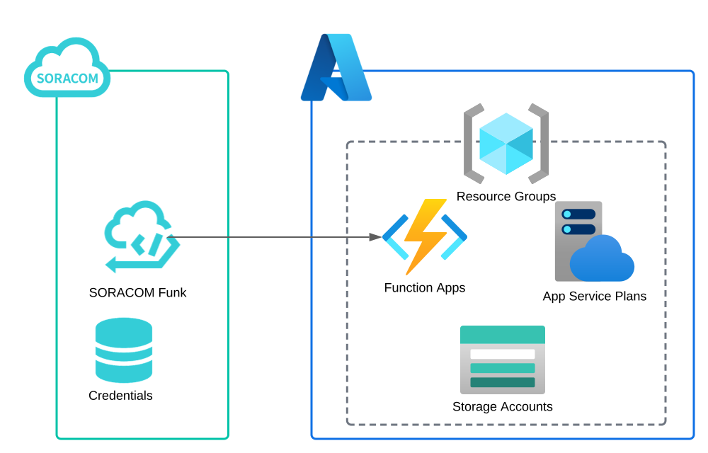

Terraform で SORACOM のリソース管理をしたかったので、SORACOM 向けの Terraform カスタムプロバイダを実装してみました。カスタムプロバイダ開発に係る知見や、Terraform provider for SORACOM で SORACOM のリソース管理をしてみた例をご紹介します。  

1. Terraform のカスタムプロバイダの概要
2. SORACOM 向けカスタムプロバイダの実装
3. SORACOM x Azure Functions の利用例

といった章立てでまとめてみます。

<!--truncate-->

---

## **1. Terraform のカスタムプロバイダの概要**

### **Why IaC ?**

そもそもなぜ IaC が必要なのか？というところから、私の過去の経験を元に整理してみます。  

新しいものはたいてい怖いもので、初見では `「ウェブコンソールとか CLI ツールで十分でしょ？IaC ツールっていらなくないですか？」` といった気持ちでした。  
確かに CLI ツールは何かのリソースの操作や状態の確認などの目的で手軽に利用できて便利です。CLI ツールを駆使したシェルスクリプトでも IaC ツールで実施しているようなリソース管理を "技術的には" 実現できるかもしれません。  
実際に CLI でリソースの管理をしようとすると、手続き的な処理を書くことになります。リソースの差分チェックや個々の処理のエラーハンドリングなど、実は厳密にやろうとすると考慮することが多くてなかなか大変です。結果、複雑でメンテナンスが困難なスクリプトが出来上がったりします。  
とまぁここまで手を動かしてみてようやく重い腰を上げて IaC ツールを触ってみるか、ということになりました。実際に使ってみると、CLI で考慮する必要のあった差分チェックやらエラーハンドリングといった複雑さをツールが丸っと面倒を見てくれるおかげで、望ましいリソースの状態を宣言的に記述してツールに喰わせるだけになるのです。リソース設定を環境の再現性をもたせて移管するといったことも簡単になります。開発者体験が飛躍的に進歩した感じがします。  
IaC ツールがこれだけ便利だと、いついかなる時も IaC がしたくなる病に駆られてちょっとした検証とかで IaC するオーバーエンジニアリングをした時期もありました。[TypeScript依存の悪循環](https://www.google.com/search?q=Typescript%E4%BE%9D%E5%AD%98%E3%81%AE%E6%82%AA%E5%BE%AA%E7%92%B0&sxsrf=ALiCzsbbYTvTMh39om3QUsgRGj7nvS3Z4w:1668426679347&source=lnms&tbm=isch&sa=X&ved=2ahUKEwj7iLncza37AhVZmFYBHe94BKoQ_AUoAXoECBkQAw&biw=1080&bih=1724&dpr=1) を想起しますね。  
IaC 化するにも作業コストがかかるので、`他者と協業する`とか`構築するシステムが大規模・複雑`になってきたときに、IaC を検討するとバランスが良いかと思います。

- CLI はあくまでワンショットのタスクの実行といった `動的な操作` を支援するツール
- IaC ツールはリソースの構築といった`静的な操作`を支援するツール

という認識を持って、用法容量を守って正しく使い分けるのが良さそうです。

### **Terraform って何？**

IaC ツールとしてカテゴライズされるソフトウェアとしては、[AWS CDK](https://aws.amazon.com/jp/cdk/)・[Terraform](https://www.terraform.io/)・[Bicep](https://learn.microsoft.com/ja-jp/azure/azure-resource-manager/bicep/overview?tabs=bicep) などがあります。  
中でも Terraform は、カスタムプロバイダと呼ばれる pluggable なインタフェースが存在していて、カスタムプロバイダを実装しさえすれば API を公開している Web サービスに対してリソースのプロビジョニングが可能になります。  
AWS, Azure, GCP などのクラウドサービスはもちろんのこと、既に数多くのカスタムプロバイダが [Terraform Registry](https://registry.terraform.io/) に公開されています。使いたいサービス向けのプロバイダが無いか検索してみると面白いです。

---
### **カスタムプロバイダの開発に役立つ資料**

カスタムプロバイダの実装に関して、私が読んで参考になった資料を紹介します。  

- **[HashiCorp / What is Terraform?](https://developer.hashicorp.com/terraform/intro)**
    - まずは一次情報にあたるのが賢明です。HashiCorp 公式の情報はかなり整理されていて読みやすいです。
- **[Call APIs with Custom SDK Providers](https://developer.hashicorp.com/terraform/tutorials/providers)**
    - とりあえず作ってみて`完全に理解した`状態になるためには、こちらのチュートリアルを一周するのがおすすめです。カスタムプロバイダの実装から、Terraform Registry に公開までキャッチアップできます。リリースパイプラインを GitHub Actions で構築する手順なんかも再利用性が高くて秀逸です。  
- **[エキスパートたちのGo言語](https://amzn.to/3fPfHuW)**
    - これまで全部英語の文献を紹介しましたが、「いやいや、日本語が良いんだけど...」という方もご安心を。`エキスパートたちのGo言語: 3.5 Custom Terraform Provider によるプロビジョニングの自動化` にもカスタムプロバイダの作り方が書いてあります。

---

ここまで記事を一通り読めば、「カスタムプロバイダなんとなく実装できそう」な状態になります。いざ開発を進めてみると、

- 具体的にどんな単位で責務を分割してパッケージに落とし込むか
- CI/CD などのパイプラインってどう構築したらいいのだろうか

といった悩みが出てくるケースもあるかと思います。そんな時は既存のカスタムプロバイダの実装の中に答えがあります。例えば [hashicorp/terraform-provider-aws](https://github.com/hashicorp/terraform-provider-aws) では、

- `internal/conns` 以下でクライアントオブジェクト周りを集約
- `internal/service` 配下に各種リソースをハンドルするパッケージを配置

といった構成になっています。「authentication 周りは conns パッケージに集約する」とか「service パッケージ以下でサービスの追加機能を横に拡張していく」といった参考になる設計が多々ありました。どんな形であれ設計レベルで暗黙の前提が決まっていると実装方法が一意になり、開発の生産性を上げてくれるので予め決めておくとよいと思います。

CI/CD については、上で言及した HashiCorp さんのチュートリアル記事 [Release and Publish a Provider to the Terraform Registry](https://developer.hashicorp.com/terraform/tutorials/providers/provider-release-publish) に、`Git tag を打つと GitHub Actions で release ジョブが回って Terraform Registry に自動的に公開される` パイプラインの記述があり非常に参考になりました。最終的に Terraform Registry への公開も想定すると、いろんなプラットフォーム向けにバイナリを生成する必要が出てきます。いちいち温かみのある手作業をしていると日が暮れてしまいますので、[goreleaser/goreleaser-action](https://github.com/goreleaser/goreleaser-action) を活用してリリースパイプラインを GitHub Actions で構築しておくと良いです。

### **API クライアントを作る**

既存のカスタムプロバイダの実装をいくつか見るとわかることですが、カスタムプロバイダの実装には原則的に API コールのための実装詳細は含まれていません。いずれも API クライアントライブラリ or SDK に実装詳細を抱え込んでもらって、provider はそれを利用するアプリケーションとしての構成になっています。  
Terraform plugin がどのように動作するのかの概略図は以下の通りです。HashiCorp 社の資料でもクライアントライブラリとして切り離す設計を推奨しています。  


!!! tip
    Tip: We recommend Terraform plugins consume an external API client library, as shown in the diagram above. If one doesn't exist, you should create one. This is aligned with modern coding practices of keeping software projects modular.  
    出典: [Perform CRUD Operations with Providers / Terraform plugins](https://developer.hashicorp.com/terraform/tutorials/configuration-language/provider-use?in=terraform%2Fconfiguration-language&utm_offer=ARTICLE_PAGE#terraform-plugins)

なお、HashiCorp 提供の plugin ライブラリが Go で書かれているので、クライアントライブラリの言語も Go がよいです。

---

## **2. SORACOM 向けカスタムプロバイダの実装**

SORACOM は SORACOM Funk, SORACOM Funnel といった各種クラウドプロバイダと簡単に接続するアプリケーションサービスを提供しています。SORACOM が Terraform 対応するとこれまで手動でやっていた諸々の連携設定作業をすべて Terraform で完結できるようになって便利なのでは？と妄想が膨らみ、今回 SORACOM 向けにカスタムプロバイダを開発するに至りました。

カスタムプロバイダ本体は Terraform Registry の [ks6088ts/soracom](https://registry.terraform.io/providers/ks6088ts/soracom/latest) に公開済ですのですぐに触れる状態です。2022/12月時点で 1000 回近くダウンロードされているようです。まだまだ工事中なポイントが多々ありまして、機能が足りてなかったりドキュメントが手薄だったりしているので contribution は大歓迎です。  
基本的には [examples](https://github.com/ks6088ts/terraform-provider-soracom/tree/main/examples) を実行していただくと雰囲気がつかめるはずです。  
SORACOM 向けの Terraform Provider の実装作業として、大きく 2 つのソフトウェア開発をしました。

- Step 1. API クライアントライブラリ [ks6088ts/soracom-sdk-go](https://github.com/ks6088ts/soracom-sdk-go) の開発
- Step 2. カスタムプロバイダ本体 [ks6088ts/terraform-provider-soracom](https://github.com/ks6088ts/terraform-provider-soracom) の開発

### **Step 1. API クライアントライブラリの開発**

OpenAPI v3 に対応した [SORACOM API リファレンス](https://users.soracom.io/ja-jp/tools/api/reference/) が公開されていますので、このスキーマファイルから機械的に Go のクライアントライブラリを生成してみましょう。  
たった 2 steps です。

1．スキーマファイル [soracom-api.ja.yaml](https://users.soracom.io/swagger/soracom-api.ja.yaml) をダウンロードして、`specs/api.yaml` に置きます。

```shell
curl -sSfL https://users.soracom.io/swagger/soracom-api.ja.yaml --output specs/api.yaml
```

2．[OpenAPI Generator](https://openapi-generator.tech/) を使って 1 でダウンロードした仕様書から下記コマンドを実行しクライアントライブラリを生成します。

```shell
npx @openapitools/openapi-generator-cli generate \
        --input-spec specs/api.yaml \
        --generator-name go \
        --output generated/api \
        --package-name api \
        --git-host github.com \
        --git-user-id ks6088ts \
        --git-repo-id soracom-sdk-go \
        --http-user-agent ks6088ts/soracom-sdk-go/0.0.3
```

コマンドラインオプションを見ていただくと、結構柔軟に所望の設定を注入することが出来ます。  
ここでは user agent やパッケージ名を好みの設定にしてコード生成しています。  
`generated/api` 以下に *.go ファイルが生成されれば成功です。ここで生成されたライブラリは [ks6088ts/soracom-sdk-go](https://github.com/ks6088ts/soracom-sdk-go) で公開しています。

#### GitHub Actions を使ってクライアントライブラリの CI をまわしてみる

自動生成したクライアントライブラリは割とすぐ使えましたが、念のためライブラリの単体テストもしておきます。私は commit をトリガーとして、クライアントライブラリの E2E テストを GitHub Actions で実行するようにしています。

自動生成したライブラリを使って CI インフラ上で API コールするテストを実施するためには、認証情報(SORACOM でいうと auth key, auth key id)を渡す必要があります。認証キーは当然秘匿する必要がありますので、GitHub の Encrypted secrets を利用します。手順は [GitHub Docs / Encrypted secrets](https://docs.github.com/en/actions/security-guides/encrypted-secrets) に書かれています。GitHub 側の設定が終われば、以下のような形で参照するだけです。
`.github/workflows/` に [test.yml](https://github.com/ks6088ts/soracom-sdk-go/blob/main/.github/workflows/test.yml) を置くだけで CI が回ります。便利な世の中になったものですね。

```yaml title=".github/workflows/test.yml"
# 一部を抜粋
      - name: Run CI test
        run: make ci-test GOPATH=/home/runner/go
        env:
          SORACOM_AUTH_KEY: ${{ secrets.SORACOM_AUTH_KEY }}
          SORACOM_AUTH_KEY_ID: ${{ secrets.SORACOM_AUTH_KEY_ID }}
          COVERAGE_TYPE: ${{ secrets.COVERAGE_TYPE }}
```

#### テスト用の SORACOM 認証キーの権限は最小に

SORACOM では SAM ユーザというリソースに対して API の実行権限を制御したキーを払いだすことができます。SAM ユーザの権限設定方法は [SORACOM User ドキュメント / 権限設定のためのパーミッション構文](https://users.soracom.io/ja-jp/docs/sam/permission/#)を参照ください。  
セキュリティリスクを最小限にするためにも権限は必要最低限のものにします。実リソースに対する細かい操作を CI で実行することに懸念がある場合は、検証を目的として使える [SORACOM API Sandbox](https://users.soracom.io/ja-jp/tools/api-sandbox/) を使ってもよいかもしれません。

### **Step 2. カスタムプロバイダ本体の開発**

まずは、ユーザが触る HCL の外部仕様を設計することから開発を始めます。  
基本的には、対象となるクラウドプロバイダの API そのものと一対一対応させたスキーマを定義することが多いです。ただ、場合によってはカスタムプロバイダの外部仕様として露出すべきではないパラメータがある場合があります。のちの使い勝手や後方互換性担保のことを考えて、利用者観点で不要なものは削除して必要十分なインタフェースになるまでダイエットさせると小回りが利く仕様に収束すると思います。  

外部仕様の設計をしていく中で、**依存関係にある複数のリソースの関係をどう表現するか** というところも少し悩みました。  
例えばリソース A とリソース B が依存関係にあることを表現するにはどうすればよいか？といった点です。  
実はこの手の悩みも既に解決されていて、クラウドサービスの世界でよく見かける「リソース A をリソース B にアタッチするリソース C」を新たに定義することが多いようです。プロビジョニング対象のウェブサービスには C というリソースの物理的な実体はないのですが、カスタムプロバイダの外部仕様においてのみ存在する仮想的なリソース C を定義することで、A と B が直接依存関係を持たないようにするのです。  
`e.g. aws_internet_gateway_attachment, azurerm_virtual_machine_data_disk_attachment`

ドキュメントに関しては、[tfplugindocs](https://github.com/hashicorp/terraform-plugin-docs) を使うとカスタムプロバイダの Go のコードからドキュメントが生成され、**コードとドキュメントが同期** されます。  
ドキュメントの更新は忘れがちなので、CI 上でドキュメント生成して commit 済みのドキュメントと diff を取るなどして、仕組みでヒューマンエラーを撲滅するアクションを採ると精神衛生上良いです。私は CI パイプラインの中に [docs-diff](https://github.com/ks6088ts/terraform-provider-soracom/blob/main/terraform.mk#L26) コマンドにあるような形で、CI 上でドキュメント生成処理を実行したあと git diff を実行して更新忘れを検知するようにしてみました。

---

## **3. SORACOM Funk x Azure Functions の利用例**

最後に、SORACOM Funk と Azure Functions の連携を Terraform で構築したサンプルを紹介します。サンプルコードは [group_configuration_funk_azure_functions_python](https://github.com/ks6088ts/terraform-provider-soracom/tree/main/examples/group_configuration_funk_azure_functions_python) にあります。  
構成図は以下の通りです。




実行にはSORACOM の認証情報のセットアップと、Azure の認証情報のセットアップが必要になります。アカウントのセットアップやリソースの設定などは各社ユーザサイトを参照してください。

- [SORACOM CLI をインストールする / ステップ 2: 認証情報を準備する](https://users.soracom.io/ja-jp/tools/cli/getting-started/#%E3%82%B9%E3%83%86%E3%83%83%E3%83%97-2-%E8%AA%8D%E8%A8%BC%E6%83%85%E5%A0%B1%E3%82%92%E6%BA%96%E5%82%99%E3%81%99%E3%82%8B)
- [Azure に対して Terraform を認証する](https://learn.microsoft.com/ja-jp/azure/developer/terraform/authenticate-to-azure?tabs=bash)

以下の操作でインフラリソースが構築/削除ができます。

```shell
# サンプルコードの取得
git clone git@github.com:ks6088ts/terraform-provider-soracom.git
cd terraform-provider-soracom/examples/group_configuration_funk_azure_functions_python

# リソースの構築
terraform init
terraform apply

# リソースの削除
terraform destroy -auto-approve
```

### Azure のリソース

- リソースグループ
- ストレージアカウント
- サービスプラン
- 関数アプリ

を生成します。サンプルコードは以下の通りです。

```tf title="azure.tf" linenums="1"
provider "azurerm" {
  features {}
}

resource "azurerm_resource_group" "example" {
  name     = "${var.azure_prefix}-rg"
  location = var.azure_resource_location
}

resource "azurerm_storage_account" "example" {
  name                     = "${var.azure_prefix}storageacct"
  resource_group_name      = azurerm_resource_group.example.name
  location                 = azurerm_resource_group.example.location
  account_tier             = "Standard"
  account_replication_type = "LRS"
}

resource "azurerm_service_plan" "example" {
  name                = "${var.azure_prefix}-sp"
  location            = azurerm_resource_group.example.location
  resource_group_name = azurerm_resource_group.example.name
  os_type             = "Linux"
  sku_name            = "S1"
}

resource "azurerm_linux_function_app" "example" {
  name                = "${var.azure_prefix}exampleapp"
  location            = azurerm_resource_group.example.location
  resource_group_name = azurerm_resource_group.example.name
  service_plan_id     = azurerm_service_plan.example.id

  storage_account_name       = azurerm_storage_account.example.name
  storage_account_access_key = azurerm_storage_account.example.primary_access_key

  site_config {
    application_stack {
      python_version = "3.9"
    }
  }
}

resource "azurerm_function_app_function" "example" {
  name            = "example-python-function"
  function_app_id = azurerm_linux_function_app.example.id
  language        = "Python"
  file {
    name    = "__init__.py"
    content = file("./app/__init__.py")
  }
  test_data = jsonencode({
    "name" = "Azure"
  })
  config_json = jsonencode({
    "scriptFile" = "__init__.py"
    "bindings" = [
      {
        "authLevel" = "function"
        "direction" = "in"
        "methods" = [
          "get",
          "post",
        ]
        "name" = "req"
        "type" = "httpTrigger"
      },
      {
        "direction" = "out"
        "name"      = "$return"
        "type"      = "http"
      },
    ]
  })
}

data "azurerm_function_app_host_keys" "example" {
  name                = "${var.azure_prefix}exampleapp"
  resource_group_name = azurerm_resource_group.example.name
  # https://github.com/hashicorp/terraform-provider-azurerm/issues/9869
  depends_on = [
    azurerm_linux_function_app.example
  ]
}
```

### SORACOM のリソース

- SIM グループ
- 認証情報
- SORACOM Funk の設定

を生成します。認証情報と SORACOM Funk の設定には、上述した Azure 側のリソース設定を反映させて連携します。

```tf title="soracom.tf" linenums="1"
terraform {
  required_providers {
    soracom = {
      source = "ks6088ts/soracom"
    }
  }
}

provider "soracom" {
  profile = var.soracom_profile
}

resource "soracom_group" "group" {
  tags = {
    name = var.soracom_group_name
  }
}

resource "soracom_credentials" "credentials" {
  credentials_id = var.credentials_id
  description    = "API Token credentials via terraform-provider-soracom"
  type           = "api-token-credentials"
  credentials = {
    # Azure Functions の設定を参照
    token = data.azurerm_function_app_host_keys.example.default_function_key
  }
}

resource "soracom_group_configuration_funk" "group_configuration_funk" {
  group_id       = soracom_group.group.id
  enabled        = true
  credentials_id = soracom_credentials.credentials.credentials_id
  content_type   = "json"

  # Azure Functions
  destination {
    provider     = "azure"
    service      = "function-app"
    # Azure Functions の呼び出し URL を参照
    resource_url = azurerm_function_app_function.example.invocation_url
  }
}
```

以上でサンプルの紹介は終了です。

これまでは Azure のリソースを作成してパラメータ設定を確認したあと、SORACOM 側の認証情報と SORACOM Funk の SIM グループの設定をウェブコンソールか SORACOM CLI で指定する必要がありました。Terraform 対応することで、そういった手作業も無くなり `terraform apply -auto-approve` すればサクッと Azure・SORACOM 双方を連携したリソースが生成できます。後片付けも `terraform destroy` でさっと終わります。より一層 SORACOM を便利に使うことができるようになりました。

---

## **ポエム: ツール開発からの学び**

この手のツールを開発してみて、改めて感じたことをポエム的に 2 点書き留めておきます。

### **1. サンプルコードから書き始めること**

今回実装したカスタムプロバイダや、API・SDK といった、プラットフォームを形成するためのソフトウェアに関して、一番注意を払うべきポイントは外部仕様であると思います。細かな内部実装上のバグなんかは都度直せますが、外部仕様は一度出すとクライアントに影響が出るため、容易に変更しづらいことが理由です。  
「なに当たり前のことを言っているんだ？」と思われる方もいらっしゃるかもしれません。しかしながら、依存する他のコンポーネントの仕様や内部実装上の制約などに気が向いてしまうと、それらに無意識的に引きずられてしまい最終的にユーザに提供する外部仕様がぎこちなくなることって意外と多くないでしょうか。カプセル化が不十分で不要なパラメータを晒したり、リソース間に不要な依存が発生していたり、直観的ではない操作を要求したり、、、少なくとも私はそういう失敗を何度もしました。こういった問題を踏んでは、[C++のためのAPIデザイン](https://amzn.to/3GgZt8x) の `第2章 優れたAPIの特徴` に事細かに書いてある原理原則を何回も読み返したりしていました。

これまでの経験の中の学びの一つに、**サンプルから書き始める(⇔外部仕様を先に策定する)** ことがあります。これは常日頃意識するようにしています。  
サンプルコードから書き始めると、嫌でもユーザの利便性や後方互換性の考慮を最初にすることになります。実装上の制約といったノイズを排除して考えることもできます。仕様のちゃぶ台返しがあっても、内部実装に着手する前なら手戻りは少なくて済みます。最初にサンプルを書いておけば、後々ユーザから「サンプルください」なんてことも言われません。メリットのほうが多いのです。  
外部仕様の検討は、真面目にやると意外に時間がかかります。動作するコードとしての成果物がなかなか出てこない分、プログラマとしては焦燥感に駆られて実装に着手してしまうのも往々にしてあると思います。  
「意識しましょう」という努力目標のルールは大抵機能しないことが多いので、内部実装を始めるより前に API のレビューや(動作しない状態の)サンプルコードのレビューを必須とする開発フローを取り入れるのも、組織の規模や提供するソフトウェアの特性によってはフィットするのかもしれません。

### **2. 自分以外の視点で良いフィードバックをくれる人を見つけること**

個人開発をしていると、目線が一つだけになり結果的に良いものができないのを思い知りました。ある程度品質や方向性が固まった段階で、早期にできるだけいろんな人に dogfooding をお願いして、率直でストレートな意見をもらうことは非常に大事であると思いました。  
特に、知識豊富なヘビーユーザーや事前知識がそこまでないライトユーザーなど、様々な人にお願いすると面白いです。前者はセキュリティ上の懸念点を見つけてくださいましたし、後者は「サンプルみれば理解できるでしょ？」みたいなマッチョな思想がイケてないことを教えてくれたりと、他者からのフィードバックで多くの気づきと改善ができました。  
今回開発したカスタムプロバイダもそうした人達との協業を通して改善していった経緯もあります。改めてこの場を借りて感謝申し上げます。

(完)