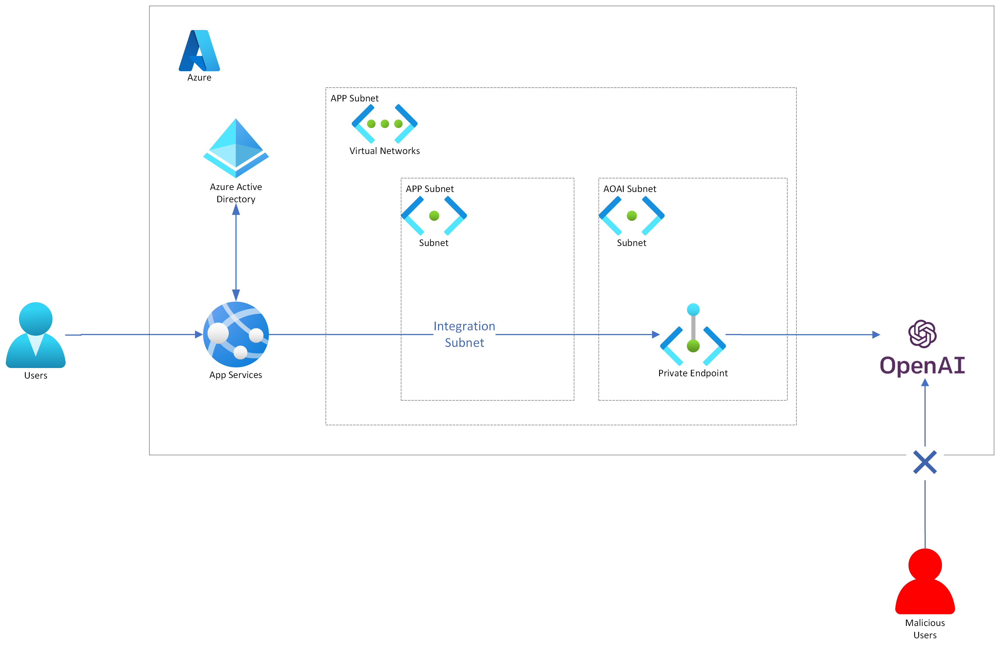

Azure OpenAI Service を利用した ChatGPT の試用環境を作成してみました。  
ChatGPT を体験する環境としては、既に OpenAI でも Azure OpenAI Service でも使い勝手のいいウェブアプリがあり、ブラウザとアカウントさえあればすぐに試せます。

- OpenAI: [ChatGPT のウェブアプリ](https://chat.openai.com/), [Playground](https://platform.openai.com/playground)
- Azure: [Azure OpenAI Studio](https://oai.azure.com/portal)

個人的なお試しという観点ですとこれらのウェブアプリを利用するだけで十分ですが、  
業務への適用を視野に入れて、広く組織内で試用するユースケースを考えると様々な課題が出てきます。  

例えば、シンプルに API Token を払い出してそのまま使う方法ですと、万が一 API Token が漏洩した場合に不正利用を防ぐことができません。また、ユーザーを組織内のメンバーに限定したい場合、何らかの方法で認証する必要がでてきます。これらの課題に対してゼロから取り組むと、本来の目的である ChatGPT の試用に割く時間が減ってしまいます。  

そこで、本記事では業務上の PoC 利用を見据え、Azure OpenAI Service を使った OpenAI API の試用環境の構築方法をサンプルコード付きで紹介します。

<!--truncate-->

## 概要


以下のようなアーキテクチャで構築します。



## ハンズオン

作業手順は以下の通りです。

---
1. Azure OpenAI Service のリソースを作成する
2. アプリケーションを開発する
3. App Service にデプロイする
4. App Service で実行されている Web アプリに認証を追加する
5. プライベートエンドポイントの設定を追加する
6. App Service の VNET 統合設定を追加する
---

以下では、これら手順について順に見ていきます。
作業が完了したら App Service の URL にアクセスして、ChatGPT を試してみましょう。

### 1. Azure OpenAI Service のリソースを作成する

[Azure OpenAI を使用してリソースを作成し、モデルをデプロイする](https://learn.microsoft.com/ja-jp/azure/cognitive-services/openai/how-to/create-resource?pivots=cli)を参考に、Azure Portal から Azure OpenAI Service を作成します。
ここで払い出した Azure Open AI のリソース名、デプロイしたモデルの名前、API キーは後で利用します。

Azure Portal にある Azure OpenAI Studio では、簡単にブラウザからデプロイしたモデルを使った動作確認ができます。

### 2. アプリケーションを開発する

OpenAI のチャットのフォームや Playground のパラメータ設定 UI など、必要な UI コンポーネントはそれなりに多く、フロントエンドアプリをゼロから書くと結構な工数になります。  
フロントエンドアプリの実装は目的ではないので、ひとまず最短で目的が達成されることを優先するため良さそうな OSS を探します。  
GitHub で Star 数でソートして、いくつか OSS を漁ってみたところ、Azure OpenAI Service を利用したそのものズバリなアプリは見つからなかったのですが、[Nashex/gpt4-playground](https://github.com/Nashex/gpt4-playground) という OpenAI の Playground をクローンした OSS が見つかりました。  
demo サイト ([GPT-4 Playground](https://www.gpt4-playground.com/)) もあって、OpenAI の API を利用している点を除き、今回の目的にほぼ合致してそうです。  

この OSS を fork して、OpenAI API をコールしている箇所を Azure OpenAI Service を利用するように変更すればサクッと動きそうです。  
以下のコードがそれに該当します。

```typescript title="gpt4-playground/src/utils/OpenAI/OpenAI.ts"
  const response = await fetch("https://api.openai.com/v1/chat/completions", {
    headers: {
      Authorization: `Bearer ${token}`,
      "Content-Type": "application/json",
    },
    method: "POST",
    body: JSON.stringify(payload),
  });
```

fetch 先 url とリクエストヘッダの `Authorization` を `api-key` に書き換えると Azure OpenAI Service で同様の機能が動きました。  
最終的に Docker イメージにしてデプロイする予定だったので、API KEY のような秘匿情報やリソース名などは環境変数で外部から設定できるようにします。Next.js フレームワークを採用しているため、環境変数の設定方法は、[Next.js のドキュメント](https://nextjs.org/docs/basic-features/environment-variables)を参照しました。

ローカル環境で動作が確認できたら、Dockerfile を書いてコンテナ化して Docker Hub に push しておきます。
イメージを作成する際は、Next.js の production build を実行して、その成果物をイメージに配置します。

fork して改変したアプリのソースコードは [ks6088ts-labs/azure-openai-playground](https://github.com/ks6088ts-labs/azure-openai-playground) に公開しています。  
パッと動かす目的で場当たり的に改変している箇所も多々あるので、参考程度にしてください。  
Docker イメージは[ks6088ts/azure-openai-playground](https://hub.docker.com/r/ks6088ts/azure-openai-playground)で公開しています。  
手元で動かしたいだけであれば、Azure OpenAI Service のリソースを払い出したあと、以下コマンドでサービスの動作確認ができます。

```shell
# run the following command and access to localhost:3000 with your browser
docker run --platform=linux/amd64 --rm \
    -p "3000:3000" \
    --env "AZURE_OPENAI_API_KEY=<YOUR API KEY>" \
    --env "AZURE_OPENAI_NAME=<YOUR AOAI NAME>" \
    --env "AZURE_OPENAI_DEPLOYMENT_NAME=<YOUR DEPLOYMENT NAME>" \
    ks6088ts/azure-openai-playground:0.0.2
```

### 3. App Service にデプロイする

2 で実装したアプリを、Azure App Service で公開します。
ここでは Docker Hub にある Docker コンテナイメージを App Service に pull して公開するシナリオとなります。

Azure CLI でコマンドを以下のように実行していきます。

```shell
# リソースグループを作成する
az group create \
    --name $RESOURCE_GROUP_NAME \
    --location japaneast

# App Service Plan を作成する
az appservice plan create \
    --name $APP_SERVICE_PLAN_NAME \
    --resource-group $RESOURCE_GROUP_NAME \
    --location japaneast \
    --sku B1 \
    --is-linux

# App Service を作成する
az webapp create \
    --name $APP_SERVICE_NAME \
    --plan $APP_SERVICE_PLAN_NAME \
    --resource-group $RESOURCE_GROUP_NAME \
    --deployment-container-image-name $CONTAINER_IMAGE_NAME

# App Service の環境変数を設定する
az webapp config appsettings set \
    --name $APP_SERVICE_NAME \
    --resource-group $RESOURCE_GROUP_NAME \
    --settings \
        WEBSITES_PORT=3000 \
        AZURE_OPENAI_API_KEY=$AZURE_OPENAI_API_KEY \
        AZURE_OPENAI_NAME=$AZURE_OPENAI_NAME \
        AZURE_OPENAI_DEPLOYMENT_NAME=$AZURE_OPENAI_DEPLOYMENT_NAME

# 設定を反映させるために App Service を再起動する
az webapp restart \
    --name $APP_SERVICE_NAME \
    --resource-group $RESOURCE_GROUP_NAME
```

これで、App Service の URL にアクセスすると、先ほどローカルで動かしたときと同じように動作するはずです。

### 4. App Service で実行されている Web アプリに認証を追加する

Web アプリに認証機能を組み込むのは結構手間です。App Service では組み込みの認証(=EasyAuth)と承認がサポートされているため、Web アプリでコードをまったく記述せずにユーザーをサインインさせることができます。  
手順は[チュートリアル: Azure App Service で実行されている Web アプリにアプリの認証を追加する](https://learn.microsoft.com/ja-jp/azure/app-service/scenario-secure-app-authentication-app-service)を参照ください。  
Azure Portal から `AppService > Authentication > Add identity provider` と辿って所望の認証プロバイダを追加するだけです。認証プロバイダも主要なものはサポートされており簡単に認証機能を追加できます。

### 5. プライベートエンドポイントの設定を追加する

Azure Virtual Network (VNet)経由のプライベートネットワーク接続に限定して Azure OpenAI Service を利用できるように設定します。
プライベートネットワーク経由でのリクエストに限定することで、万が一 API Key が漏れたとしても外部からのリソースの不正利用を防ぐことができます。  
手順は[Azure OpenAIにプライベートエンドポイント（Private Endpoint）を設定して東日本リージョンの仮想ネットワークのみから使う](https://blog.jbs.co.jp/entry/2023/04/07/173940)を参照ください。記事に従って、Azure Portal から以下の操作を実施すると、確かに期待通り Azure OpenAI Playground から API が呼び出せないことを確認できました。

- `Azure OpenAI > Networking > Firewalls and virtual networks > Disabled` に設定し、Private Endpoint を有効化する
- `Azure OpenAI > Networking > Private endpoint connections > + Private endpoint` から Private Endpoint を作成する

なお、ネットワーク周りの設定は即時反映では無いので少し待ってから確認する必要があります。急いで確認したら反映されていなくてハマりました。  
気になって API レスポンスの中身も確認したかったので curl で直接 REST API を叩いてみました。

```shell
curl "https://${AOAI_NAME}.openai.azure.com/openai/deployments/${MODEL_NAME}/completions?api-version=2022-12-01" \
  -H 'api-key: your-api-key' \
  -H 'content-type: application/json' \
  --data-raw '{"prompt":"Write a product launch email for new AI-powered headphones that are priced at $79.99 and available at Best Buy, Target and Amazon.com. The target audience is tech-savvy music lovers and the tone is friendly and exciting.\n\n1. What should be the subject line of the email?  \n2. What should be the body of the email?","temperature":1,"top_p":1,"frequency_penalty":0,"presence_penalty":0,"max_tokens":350,"stop":null,"stream":true}' \
  --compressed -vvvv
```

レスポンスの中には以下のパラメータもありましたので、Private Endpoint が確かに有効になっていそうです。

- `policy-id: ThrowExceptionDueToTrafficDenied`
- `{"error":{"code":"AccessDenied","message": "Public access is disabled. Please configure private endpoint."}}`

### 6. App Service の VNET 統合設定を追加する

App Service の Outbound 通信設定で VNet 統合を有効化し、App Service からのリクエストを VNet 経由で Azure OpenAI Service に送信するように設定します。
[【Azure】App ServiceのVNet統合とプライベートリンクを利用した通信閉域化](https://techblog.ap-com.co.jp/entry/2021/03/12/150117)を参考に、`AppService > Networking > Outbound Traffic > VNet integration > + Add VNet` から VNet を追加します。


## まとめ

ここまでの手順を実行して、以下の動作を確認できました。

- 未認証ユーザーは所定の認証プロバイダの認証画面にリダイレクトされる
- 認証に成功すると、Web アプリの画面が表示される
- チャットフォームから送信した文章に対して Azure OpenAI Service が応答する
- Azure OpenAI Playground から API を叩くとエラーになる

本記事では、Azure OpenAI Service を App Service から利用するための手順をまとめました。
App Service の組み込み認証や、Vnet 統合を利用することで、手間を掛けることなく Azure OpenAI Service を安全に利用する環境を構築できました。

