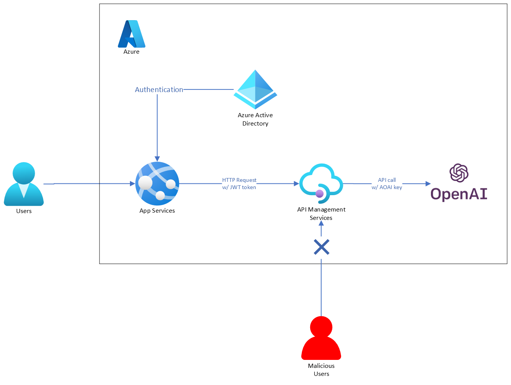

[Azure OpenAI Service を利用した ChatGPT お試し環境の構築](/blog/fork-azure-openai-playground) では、ChatGPT を体験する環境を簡単に構築する方法をご紹介しました。

既にご利用いただけたユーザーからのフィードバックとして、「実際の利用ログなどを確認したい」というご要望をいただきました。

本記事では Azure マネージドサービスを利用してコーディングせずに利用ログを収集する方法を紹介します。

<!--truncate-->

## 概要

Azure を利用する場合、候補に挙がるのは Azure API Management (以下、APIM)の利用です。

APIM は、Azure が提供するマネージドな API ゲートウェイのサービスで、バックエンドにあるサービスを提供する API を一括で管理して様々な処理 (セキュリティ、レート制限、データ変換、監視、など) を仲介するものです。

今回のスコープである利用ログの収集は、App Service にデプロイしたアプリからのリクエストを APIM を経由させてロギングするような構成で実現できます。



本記事のスコープ外ではありますが、APIM 自体は非常に多機能なサービスなので、API の呼び出し回数を制限するレート制限の設定なども AOAI の利用においては利用が見込まれる機能かと思います。具体的な AOAI の制限については、[Azure OpenAI Service のクォータと制限](https://learn.microsoft.com/ja-jp/azure/cognitive-services/openai/quotas-limits)に記載があります。

また、特に大規模なシステム開発の文脈ですと、APIM を境界として、サーバ・クライアント開発者が分業できる開発体制面でのメリットもあります。

(要望が有り次第また発信しようと思います。)

## ハンズオン

---
1. Azure OpenAI Service を作成する
1. API Management を作成する
1. API Management のバックエンド API を登録する
1. App Service にアプリをデプロイする
1. 認証処理を追加する
1. ログ出力を有効化する
1. 動作確認

---

### Azure OpenAI Service を作成する

[Azure OpenAI を使用してリソースを作成し、モデルをデプロイする](https://learn.microsoft.com/ja-jp/azure/cognitive-services/openai/how-to/create-resource?pivots=web-portal) を参考に Azure Portal から AOAI のリソースとモデルを作成します。

### API Management を作成する

[Azure portal を使用して新しい Azure API Management サービス インスタンスを作成する](https://learn.microsoft.com/ja-jp/azure/api-management/get-started-create-service-instance) を参考に APIM のサービスインスタンスを作成します。

### API Management のバックエンド API を登録する

APIM のバックエンド API として AOAI を登録します。  
AOAI は [Azure OpenAI Service の REST API リファレンス](https://learn.microsoft.com/ja-jp/azure/cognitive-services/openai/reference)に REST API の OpenAPI 仕様が公開されています。

OpenAPI 仕様が公開されているバックエンド API であれば、[チュートリアル:最初の API のインポートと発行](https://learn.microsoft.com/ja-jp/azure/api-management/import-and-publish)の手順に沿って、APIM にインポートすることができます。

詳細な手順は、[エンタープライズ向けAzure OpenAIアプリ基盤 / 機能 / API Management](https://github.com/Azure-Samples/openai-python-enterprise-logging/blob/main/README.ja.md#api-management) に記載があります。

※ 執筆時点(2023/06)では、直接 APIM に AOAI の OpenAPI 仕様をインポートしようとすると、AOAI の OpenAPI 仕様には import できないパラメータが含まれているため、HTTP API を一旦作成した後に OpenAPI 仕様のインポートをする必要がありました。

AOAI の REST API の仕様は GitHub の [specification/cognitiveservices/data-plane/AzureOpenAI/inference/stable](https://github.com/Azure/azure-rest-api-specs/tree/main/specification/cognitiveservices/data-plane/AzureOpenAI/inference/stable) のあたりに公開されております。

AOAI に限らずですが、[Swagger Petstore](https://petstore.swagger.io/) にアクセスして、見たい OpenAPI spec の json を URL に指定するとウェブブラウザから見やすい形で API 仕様が確認できるので便利です。

インポートできたら APIM の Policy 設定を追加する作業に入ります。  
ここでは、クライアントから APIM へ HTTP リクエストすると AOAI が呼び出されるように以下の二点の設定します。

1. Backend API の URL 設定
1. AOAI の API Key をヘッダーに追加する設定

なお、Portal から APIM の設定変更をしている操作は、Policy の XML ファイルを書き換えていることとほぼ同義です。  
Azure Portal から GUI ベースで設定する方法は始めは判りやすいのですが、設定項目が増えると面倒です。ある程度慣れたり、決まった設定があるのであれば XML をコピペして直接書き換えるほうが操作が楽になります。  

最終的に Policy の設定は以下のようになります。適宜 backend url や API key を書き換えてください。

```xml
<policies>
    <inbound>
        <base />
        <!-- 1. Backend API の URL 設定, https://{Azure OpenAI Service の Endpoint}/openai -->
        <set-backend-service base-url="https://your-aoai.openai.azure.com/openai" />
        <!-- 2. AOAI の API Key をヘッダーに追加する設定 -->
        <set-header name="api-key" exists-action="override">
            <value>your-aoai-key</value>
        </set-header>
    </inbound>
    <backend>
        <base />
    </backend>
    <outbound>
        <base />
    </outbound>
    <on-error>
        <base />
    </on-error>
</policies>
```

また、ここでは簡素化のため Subscription キーの要求は無効化します。API の設定から `Subscription required` のチェックボックスを外して無効化してください。

ここまで設定したら、Azure Portal の `APIM > APIs > {AOAI} > Test` タブから適当な API を選んで、`deployment-id`Azure Portal の Test から、APIM 経由で AOAI の API を呼び出す動作確認を行うことができます。

ここでは、

- APIM にリクエスト発行すると AOAI API のレスポンスが取得できる
- (APIM が内部的にヘッダを設定するので)クライアントは AOAI の API Key をヘッダに含めなくてよい

ということが確認できます。

### App Service にアプリをデプロイする

おもむろに App Service にアプリをデプロイします。
App Service にデプロイする際、ローカルマシンのランタイムや環境依存で困りたくないので、私は基本的にコンテナイメージを Docker Hub に置いてデプロイしています。

```shell
RESOURCE_GROUP_NAME=rg-easyauth-apim
APP_SERVICE_PLAN_NAME=plan-easyauth-apim
APP_SERVICE_NAME=app-easyauth-apim
CONTAINER_IMAGE_NAME=ks6088ts/azure-openai-playground

# リソースグループを作成する
az group create \
    --name $RESOURCE_GROUP_NAME \
    --location japaneast

# App Service Plan を作成する
az appservice plan create \
    --name $APP_SERVICE_PLAN_NAME \
    --resource-group $RESOURCE_GROUP_NAME \
    --location japaneast \
    --sku B1 \
    --is-linux

# App Service を作成する
az webapp create \
    --name $APP_SERVICE_NAME \
    --plan $APP_SERVICE_PLAN_NAME \
    --resource-group $RESOURCE_GROUP_NAME \
    --deployment-container-image-name $CONTAINER_IMAGE_NAME

# App Service の環境変数を設定する
AZURE_OPENAI_API_URL="https://your-apim.azure-api.net/deployments/your-deployment-id/chat/completions?api-version=2023-05-15"

az webapp config appsettings set \
    --name $APP_SERVICE_NAME \
    --resource-group $RESOURCE_GROUP_NAME \
    --settings \
        WEBSITES_PORT=3000 \
        AZURE_OPENAI_API_URL=$AZURE_OPENAI_API_URL

# 設定を反映させるために App Service を再起動する
az webapp restart \
    --name $APP_SERVICE_NAME \
    --resource-group $RESOURCE_GROUP_NAME
```

ここまでで、App Service にアプリがデプロイされます。
App Service にアクセスしてチャット画面から動作確認を行うことができます。

この時点では認証はかかっておらず、インターネットから誰でもアクセスできてしまう点にご注意ください。

APIM と認証情報をやり取りするため、フロントエンドアプリからは JWT を HTTP のリクエストヘッダに添える必要があります。具体的には、

- `/.auth/me` の json レスポンスの中の `access_token` (=JWT) を取得
- `Authorization: Bearer {access_token}` をヘッダに付与して APIM に HTTP リクエストする

となります。

### 認証処理を追加する

App Service と API Management の認証設定を行います。

#### App Service の組み込み認証(EasyAuth) を有効にする

組み込み認証が何たるかは [Azure App Service および Azure Functions での認証と承認](https://learn.microsoft.com/ja-jp/azure/app-service/overview-authentication-authorization) を参照してください。
アプリケーション開発者観点ですと、認証処理の一切を App Service に任せることができる仕組みで、リクエストが Web アプリに到達する前段で認証処理を行ってくれるものと捉えておけばよいです。

実際の設定方法は[チュートリアル: Azure App Service で実行されている Web アプリにアプリの認証を追加する](https://learn.microsoft.com/ja-jp/azure/app-service/scenario-secure-app-authentication-app-service)が詳しいです。Azure Portal 上の操作で認証設定を入れるのに、`Azure Active Directory` ではなく、`App Service` のリソースから辿っていく操作になる旨、ご注意ください。

認証設定が追加されると、認証前のクライアントは Azure AD 認証画面にリダイレクトされるようになります。  
認証が完了するとアプリにアクセスできます。認証が完了したブラウザから、`https://{appservice の url}/.auth/me` にアクセスすると `access_token` として JWT が取得できます。  
ref. [Azure App Service 認証でユーザー ID を操作する / API を使用してユーザー クレームにアクセスする](https://learn.microsoft.com/ja-jp/azure/app-service/configure-authentication-user-identities#access-user-claims-using-the-api)

#### API Management の API に認証情報の検証を追加する

App Service で認証が完了した後、API Management で認証情報の検証を行います。
[Azure Active Directory のトークンの検証](https://learn.microsoft.com/ja-jp/azure/api-management/validate-azure-ad-token-policy)にありますように、API Management には `validate-azure-ad-token` というポリシーがあります。

Inbound Processing に以下のように `validate-azure-ad-token` を追加します。
`tenant-id`, `application-id` は EasyAuth で設定したものを指定します。

```xml
<inbound>
    <validate-azure-ad-token tenant-id="your-tenant-id">
        <client-application-ids>
            <application-id>your-application-id</application-id>
        </client-application-ids>
    </validate-azure-ad-token>
</inbound>
```

最終的にできあがった API Management のポリシーの全体像は以下のようになります。

```xml
<policies>
    <inbound>
        <base />
        <set-backend-service base-url="https://your-aoai.openai.azure.com/openai" />
        <set-header name="api-key" exists-action="override">
            <value>your-aoai-key</value>
        </set-header>
        <validate-azure-ad-token tenant-id="your-tenant-id">
            <client-application-ids>
                <application-id>your-application-id</application-id>
            </client-application-ids>
        </validate-azure-ad-token>
    </inbound>
    <backend>
        <base />
    </backend>
    <outbound>
        <base />
    </outbound>
    <on-error>
        <base />
    </on-error>
</policies>
```

### ログ出力を有効化する

[Log Analytics ワークスペースを作成する](https://learn.microsoft.com/ja-jp/azure/azure-monitor/logs/quick-create-workspace?tabs=azure-portal)を参考に Azure Portal から Log Analytics Workspace を作成します。

`APIM > Diagnostic settings` にて、`Add diagnostic setting` を選択し以下の設定を作成します。
  - `Logs > audit/allLogs を有効化`
  - `Log Analytics Workspace を有効化`
  - `Archive to a storage account` を選択

### 動作確認

以下の操作を行い、意図した動作になっているかを確認します。

- App Service の URL にアクセスする
  - 認証画面にリダイレクトされることを確認
- APIM の Log を確認(任意)
  - JWT のヘッダが渡っていることを確認
- JWT のヘッダなしで APIM にリクエストして API が呼び出せないことを確認
  - `401 Unauthorized` が返ってくることを確認
- `APIM > Logs` を開き、クエリとして `ApiManagementGatewayLogs` を実行し、ログが出力されていることを確認

## Tips

### デバッグ方法

開発過程で私が踏んだトラブルやそのデバッグ方法について記載します。

#### ログ出力を有効化は開発観点でも有効

APIM 連携をした際、ポリシー設定が適切に動作しているかの確認や、何か失敗したときの原因を調査する観点でもロギングは有効でした。マネージドサービスということで処理の詳細が隠蔽されてしまうと、えてして開発が困難になりがちなのですが、`LastErrorReason` や `LastErrorMessage` などの情報は、何が原因で失敗したかを調査する際に非常に役立ちました。  
たとえば、`validate-azure-ad-token` で失敗した場合、`LastErrorReason` に `Invalid JWT token. Token is expired.` というように、失敗した理由がわかったり、
`LastErrorReason: SubscriptionKeyNotFound`, `LastErrorMessage: Access denied due to missing subscription key. Make sure to include subscription key when making requests to an API.` が出ている時は Subscription key が抜けていたのだな、など。

#### クライアントとサーバを切り分けて動かす

アプリと APIM の連携に関しては、何か不具合が起きたときに App Service なのか APIM の設定なのかの原因切り分けを行うことが重要です。
不具合原因の特定のために、事実の積み上げと仮説の検証をループするわけですが、このときに、クライアントとサーバを切り分けて動かすことで、原因の特定がしやすくなります。

双方が関係しあうインタフェースたる部分は、主に JWT になります。フロントエンドアプリで認証を行った状態で、ブラウザから `https://{appservice の URL}/.auth/me` にアクセスし、`access_token` (JWT) を取得し、curl などで APIM にリクエストを送るという手順で、APIM にリクエストを送って切り分けたりしていました。

APIM のポリシー設定は触った感じ即時反映のように見えるのですが、時々心配になったときはユーザー定義できるエラーメッセージの文字列を変えるなどの tips も同僚から教わりました(感謝！)。
