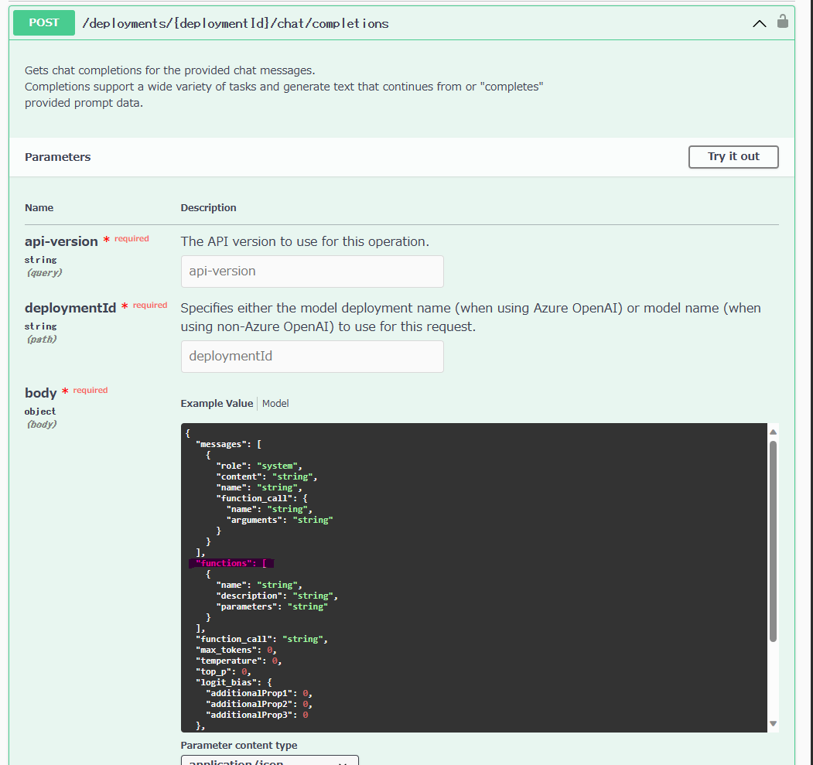

Azure OpenAI Service を用いた Function Calling を理解するためのハンズオンを行いました。初見では何をしているのかよくわからなかったこともあったので、自分が理解していった過程をまとめておいて後続の誰かに役に立てばと思い足跡を残しておきます。  

OpenAI 回りのエコシステムは急速に発展していて、 Function Calling の feature 自体は OpenAI 社が機能を公開してからしばらく経っているため既にライブラリ側でのサポートが入っています。実際のアプリ開発では LangChain, Semantic Kernel, OpenAI などのライブラリを利用してアプリを開発することが多いと思うので、それらのライブラリを利用した場合の実装例も併せて紹介します。

<!--truncate-->

## ハンズオンの概要

低層のソフトウェアの理解があると、上位のレイヤーの実装を読む際にも実装のイメージがつかみやすく、理解が深まると思いますので淡々と低層のソフトウェアから徐々に理解していく形でハンズオンをしました。

1. REST API 仕様書の確認
1. curl で呼び出す
1. OpenAI ライブラリから呼び出す
1. LangChain ライブラリから呼び出す

特に新しいソフトウェアを触る場合、依存関係の少ない順に見ていくとソフトウェア固有の振る舞いや不具合に振り回されなくて済むので、低層のソフトウェアから触っていくスタイルが好きです。

### 1. REST API 仕様書の確認

API 仕様書が一次情報となりますので、[Azure OpenAI Service REST API reference / Chat completions](https://learn.microsoft.com/en-us/azure/ai-services/openai/reference#chat-completions) を確認します。ドキュメント内のリンクをたどると、どうやら Azure の REST API は GitHub リポジトリで公開されているようで、[specification/cognitiveservices/data-plane/AzureOpenAI/inference](https://github.com/Azure/azure-rest-api-specs/tree/main/specification/cognitiveservices/data-plane/AzureOpenAI/inference) に各 API バージョンの OpenAPI 仕様書があります。  
気になる箇所を blame して差分の意図を推測したり、コミットログを読んで変更の経緯を確認したりすると味わい深いです。

今回注目するのは、[2023-07-01-preview](https://github.com/Azure/azure-rest-api-specs/blob/main/specification/cognitiveservices/data-plane/AzureOpenAI/inference/preview/2023-07-01-preview/generated.json) の仕様です。json だと見づらいので、私は [Swagger UI の demo サイト](https://petstore.swagger.io/) にアクセスして、入力フォームに OpenAPI spec の仕様書の URL `https://raw.githubusercontent.com/Azure/azure-rest-api-specs/main/specification/cognitiveservices/data-plane/AzureOpenAI/inference/preview/2023-07-01-preview/generated.json` を貼り付けてブラウザで確認しています。

スキーマを確認すると、`POST /deployments/{deploymentId}/chat/completions` のリクエスト body に `functions` なるスキーマが定義されています。



### 2. curl で呼び出す

仕様を確認できたので、次は実際に Azure OpenAI Service のリソースをデプロイして叩いてみます。[Function calling is now available in Azure OpenAI Service](https://techcommunity.microsoft.com/t5/azure-ai-services-blog/function-calling-is-now-available-in-azure-openai-service/ba-p/3879241) を読むと、

> Function calling is now available in Azure OpenAI Service and gives the latest 0613 versions of gpt-35-turbo and gpt-4 the ability to produce structured JSON outputs based on functions that you describe in the request.

とのことなので、ここでは gpt-35-turbo の 0613 モデルを使ってみます。 適当な関数の例も欲しかったので、[Function calling and other API updates](https://openai.com/blog/function-calling-and-other-api-updates) に掲載されているサンプルを参考にしてみます。

API を叩く方法は色々あります。Postman とかも便利で良いと思いますが、今回はシュッと手早く確認したいだけなので、curl で以下の通り叩いてみます。

```shell
# Set variables
AOAI_NAME="your-aoai-name"
AOAI_DEPLOYMENT_ID="your-deployment-id"
AOAI_API_KEY="your-aoai-api-key"

❯ curl -s "https://${AOAI_NAME}.openai.azure.com/openai/deployments/${AOAI_DEPLOYMENT_ID}/chat/completions?api-version=2023-07-01-preview" \
    -H "api-key: $AOAI_API_KEY" \
    -H 'Content-Type: application/json' -d '{
  "model": "gpt-3.5-turbo-0613",
  "messages": [
    {"role": "user", "content": "What is the weather like in Boston?"}
  ],
  "functions": [
    {
      "name": "get_current_weather",
      "description": "Get the current weather in a given location",
      "parameters": {
        "type": "object",
        "properties": {
          "location": {
            "type": "string",
            "description": "The city and state, e.g. San Francisco, CA"
          },
          "unit": {
            "type": "string",
            "enum": ["celsius", "fahrenheit"]
          }
        },
        "required": ["location"]
      }
    }
  ]
}' | jq -r .
{
  "id": "chatcmpl-7fN4Um1D4qgK4wqBIkm0i0ZQI3W4H",
  "object": "chat.completion",
  "created": 1690094490,
  "model": "gpt-35-turbo",
  "prompt_annotations": [
    {
      "prompt_index": 0,
      "content_filter_results": {
        "hate": {
          "filtered": false,
          "severity": "safe"
        },
        "self_harm": {
          "filtered": false,
          "severity": "safe"
        },
        "sexual": {
          "filtered": false,
          "severity": "safe"
        },
        "violence": {
          "filtered": false,
          "severity": "safe"
        }
      }
    }
  ],
  "choices": [
    {
      "index": 0,
      "finish_reason": "function_call",
      "message": {
        "role": "assistant",
        "function_call": {
          "name": "get_current_weather",
          "arguments": "{\n\"location\": \"Boston, MA\"\n}"
        }
      },
      "content_filter_results": {}
    }
  ],
  "usage": {
    "completion_tokens": 17,
    "prompt_tokens": 82,
    "total_tokens": 99
  }
}
```

何らかのエラーがでた場合は詳細な動作を見るために、verbose オプションを付けると挙動の詳細が追えますので、`-vvv` を付けて deep dive してみてください。

レスポンスを見たところ、Function Calling は API サーバー側で Function を call してくれるわけではなくて、Function のシグネチャとメッセージの内容を LLM に渡すと、その情報を元に呼び出すべき Function (とその引数の値)を suggest してくれる、といった感じです。

例では、現在の天気を取得する `get_current_weather` なる関数を定義して、ボストンの天気を聞く質問文を添えてリクエストしています。
レスポンスの中に `choices` というキーがあり、その中に `finish_reason` が `function_call` となっているのが確認できます。また、 `get_current_weather` という関数をどんな引数を添えて呼び出すべきかを返してくれています。

自分が最初勘違いしていたので繰り返し書きますが、Function Calling は関数の呼び出し自体はやっておらず、あくまで呼び出すべき関数呼び出しの方法を教えてくれている形になり、その関数を呼ぶか否かはクライアントアプリ側の裁量次第となります。

結局これ、何が嬉しいの？ってところですが、システム間連携の実装が大分楽になって安定性も上がる点が物凄く嬉しいポイントかと思います。今まではシステム間連携を LLM と実施する際に一生懸命「こんな json フォーマットで返してくれ」、みたいなプロンプトを書いて、帰ってきた文字列を validation して parse して、取得した json を外部システムに渡して、、みたいな苦労がありました。
こうした苦労がすべて綺麗に LLM 側の Function Calling で置き換えられるようになったので、アプリの実装は簡素になり、さらにアプリの安定性も増すメリットがでてきました。システム間連携をする場合にはぜひ利用すべき機能だと思います。

### 3. OpenAI ライブラリから呼び出す

[Working with functions in Azure OpenAI](https://github.com/Azure-Samples/openai/blob/main/Basic_Samples/Functions/working_with_functions.ipynb) がとても参考になります。
上記の curl の例と同じ処理を OpenAI ライブラリで実装する場合は以下の通りです。

```python
def get_function_call(messages, function_call = "auto"):
    # Define the functions to use
    functions = [
        {
            "name": "get_current_weather",
            "description": "Get the current weather in a given location",
            "parameters": {
                "type": "object",
                "properties": {
                    "location": {
                        "type": "string",
                        "description": "The city and state, e.g. San Francisco, CA",
                    },
                    "unit": {"type": "string", "enum": ["celsius", "fahrenheit"]},
                },
                "required": ["location"],
            },
        },
    ]

    # Call the model with the user query (messages) and the functions defined in the functions parameter
    response = openai.ChatCompletion.create(
        deployment_id = deployment_id,
        messages=messages,
        functions=functions,
        function_call=function_call, 
    )

    return response
```

なにやら `functions` なる巨大なオブジェクトが登場しましたが、これが関数の説明になります。スキーマも API の仕様に合わせる必要があるので若干注意を要します。
このコードでは関数の suggest までになっていますが、次は suggest された関数を呼び出して適切な回答を得るコードスニペットを紹介します。

```python
def run_multiturn_conversation(messages, functions, available_functions, deployment_id):
    # Step 1: send the conversation and available functions to GPT

    response = openai.ChatCompletion.create(
        deployment_id=deployment_id,
        messages=messages,
        functions=functions,
        function_call="auto", 
        temperature=0
    )

    # Step 2: check if GPT wanted to call a function
    while response["choices"][0]["finish_reason"] == 'function_call':
        response_message = response["choices"][0]["message"]
        print("Recommended Function call:")
        print(response_message.get("function_call"))
        print()
        
        # Step 3: call the function
        # Note: the JSON response may not always be valid; be sure to handle errors
        
        function_name = response_message["function_call"]["name"]
        
        # verify function exists
        if function_name not in available_functions:
            return "Function " + function_name + " does not exist"
        function_to_call = available_functions[function_name]  
        
        # verify function has correct number of arguments
        function_args = json.loads(response_message["function_call"]["arguments"])
        if check_args(function_to_call, function_args) is False:
            return "Invalid number of arguments for function: " + function_name
        function_response = function_to_call(**function_args)
        
        print("Output of function call:")
        print(function_response)
        print()
        
        # Step 4: send the info on the function call and function response to GPT
        
        # adding assistant response to messages
        messages.append(
            {
                "role": response_message["role"],
                "name": response_message["function_call"]["name"],
                "content": response_message["function_call"]["arguments"],
            }
        )

        # adding function response to messages
        messages.append(
            {
                "role": "function",
                "name": function_name,
                "content": function_response,
            }
        )  # extend conversation with function response

        print("Messages in next request:")
        for message in messages:
            print(message)
        print()

        response = openai.ChatCompletion.create(
            messages=messages,
            deployment_id=deployment_id,
            function_call="auto",
            functions=functions,
            temperature=0
        )  # get a new response from GPT where it can see the function response

    return response
```

suggest された関数を呼び出し、その結果を prompt に追加し、OpenAPI を呼び出す処理をひたすら繰り返して、`finish_reason` が `function_call` でなくなったらようやく回答を得る、という流れになります。  
実装のイメージはこれで大体理解できました。

### 4. LangChain ライブラリから呼び出す

OpenAI ライブラリで関数を登録する際に正直しんどいと思うポイントが 2 つありました。

1. 関数の説明のための json お化けみたいなもの作る
2. suggest された関数を呼び出して回答を得るまでの繰り返し処理

1 は型の制約なども掛けられないですし、正直に言うとあまり書きたくない気持ちになります。2 は結果を得るまでのループ処理をアプリ側のコードに仕込むのは面倒です。
小規模なサンプルだとこのあたりをコピペで済ませることは多いと思うのですが、将来的にプロダクトのコードに組み込む場合は、ライブラリ側で吸収してくれると嬉しいです。

ここでは例として、[LangChain](https://github.com/langchain-ai/langchain) での実装を見てみます。Release note をみたところ、[v0.0.200](https://github.com/langchain-ai/langchain/releases/tag/v0.0.200) 時点で既に入っていたようで開発の早さが伺えます。

Azure OpenAI Service を利用して、LangChain を利用したサンプルコードは以下になります。

```python title="main.py"
import logging
import os

import openai
from dotenv import load_dotenv
from langchain import LLMMathChain
from langchain.agents import AgentType, Tool, initialize_agent
from langchain.chat_models import ChatOpenAI

dotenv_path = os.path.join(".", ".env")
load_dotenv(dotenv_path)

OPENAI_DEPLOYMENT_ID = os.getenv("OPENAI_DEPLOYMENT_ID")
OPENAI_API_KEY = os.getenv("OPENAI_API_KEY")
OPENAI_API_BASE = os.getenv("OPENAI_API_BASE")

openai.api_type = "azure"
openai.api_key = OPENAI_API_KEY
openai.api_base = OPENAI_API_BASE
openai.api_version = "2023-07-01-preview"


if __name__ == "__main__":
    llm = ChatOpenAI(
        model_name="gpt-35-turbo",
        temperature=0,
        model_kwargs={"deployment_id": OPENAI_DEPLOYMENT_ID},
    )

    tools = [
        Tool(
            name="Calculator",
            func=LLMMathChain.from_llm(llm=llm, verbose=True).run,
            description="数理計算の結果を返します",
        ),
    ]

    agent = initialize_agent(
        tools=tools, llm=llm, agent=AgentType.OPENAI_FUNCTIONS, verbose=True
    )

    for request in [
        "1955年10月28日は2023年7月24日の何日前ですか？",
    ]:
        logging.debug(agent.run(request))
```

```ini title=".env"
# OpenAI API
OPENAI_DEPLOYMENT_ID="YOUR_AOAI_DEPLOYMENT_ID"
OPENAI_API_BASE="https://YOUR_AOAI_NAME.openai.azure.com/"
OPENAI_API_KEY="YOUR_AOAI_API_KEY"
```

```txt title="requirements.txt"
aiohttp==3.8.5
aiosignal==1.3.1
async-timeout==4.0.2
attrs==23.1.0
certifi==2023.7.22
charset-normalizer==3.2.0
dataclasses-json==0.5.13
frozenlist==1.4.0
greenlet==2.0.2
idna==3.4
langchain==0.0.242
langsmith==0.0.14
marshmallow==3.20.1
multidict==6.0.4
mypy-extensions==1.0.0
numexpr==2.8.4
numpy==1.25.1
openai==0.27.8
openapi-schema-pydantic==1.2.4
packaging==23.1
pydantic==1.10.12
python-dotenv==1.0.0
PyYAML==6.0.1
requests==2.31.0
SQLAlchemy==2.0.19
tenacity==8.2.2
tqdm==4.65.0
typing-inspect==0.9.0
typing_extensions==4.7.1
urllib3==2.0.4
yarl==1.9.2
```

```shell
$ python main.py


> Entering new AgentExecutor chain...

Invoking: `Calculator` with `2023年7月24日 - 1955年10月28日`


> Entering new LLMMathChain chain...
2023年7月24日 - 1955年10月28日\```text
(2023 * 365 + 7 * 30 + 24) - (1955 * 365 + 10 * 30 + 28)
\```
...numexpr.evaluate("(2023 * 365 + 7 * 30 + 24) - (1955 * 365 + 10 * 30 + 28)")...

Answer: 24726
> Finished chain.
Answer: 247261955年10月28日から2023年7月24日までの日数は、24726日です。

> Finished chain.
```

(計算は間違っていますが...) 関数の呼び出しと回答の取得までの処理がライブラリ側で吸収されていることが確認できます。今回は既存の数値計算用の `LLMMathChain` を利用しましたが、LangChain ではカスタムの Tool を実装することもできます。
[Defining Custom Tools](https://python.langchain.com/docs/modules/agents/tools/custom_tools)を読むとカスタムツールの実装方法が理解できます。  
Agent に Tool を付け足す形での実装ができるので、外部システムとの連携も簡単に実装できそうです。

## まとめ

今回は Azure OpenAI Service の Function Calling のハンズオンを行いました。  
Function Calling は関数の呼び出し自体はやっておらず、あくまで呼び出すべき関数呼び出しの方法を教えてくれている形になり、その関数を呼ぶか否かはクライアントアプリ側の裁量次第となります。  
システム間連携の実装が大分楽になって安定性も上がる点が物凄く嬉しいポイントかと思います。  
呼び出し回りの実装は複雑化しやすくなるので、メンテナンス観点ですとライブラリを利用するなどをお勧めします。
