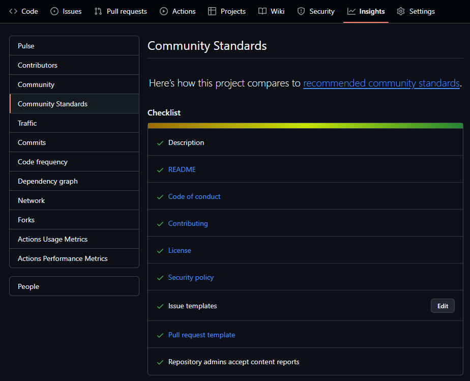

GitHub では、Organization または個人用アカウント配下に `.github` という名前のリポジトリを作成し、その中にデフォルトの設定ファイルを配置することで、Code of Conduct や Contributing Guide、Issue テンプレート、Pull Request テンプレート、Security Policy などの設定を共通化することができます。

本記事では GitHub リポジトリにデフォルトの設定ファイルを追加する方法と、その設定ファイルの内容について説明します。

<!--truncate-->

## TL;DR

- `ORGANIZATION/.github` という名前のリポジトリを作成し、その中にデフォルトの設定ファイルを配置することで、コントリビューターに対して一貫性のある情報を提供することができます。
- デフォルトの設定ファイルは、以下のようなものがあります。
  - `CODE_OF_CONDUCT.md`: 行動規範を記載する
  - `CONTRIBUTING.md`: コントリビューションのガイドラインを記載する
  - `ISSUE_TEMPLATE`: Issue のテンプレートを記載する
  - `PULL_REQUEST_TEMPLATE`: Pull Request のテンプレートを記載する
  - `SECURITY.md`: セキュリティに関する情報を記載する
- 実際に設定ファイルを追加したサンプルを以下のリポジトリにて公開しています。
  [https://github.com/ks6088ts-labs/.github](https://github.com/ks6088ts-labs/.github)

---

## Default Community Health Files とは

コントリビュートガイドライン、行動規範、Issue テンプレート、Pull Request テンプレート、セキュリティポリシーなどの設定ファイルを Community Health Files と呼びます。
これらのファイルをリポジトリに配置することで、コントリビューターに対して一貫性のある情報を提供することができます。

GitHub では `.github` という名前のリポジトリを作成し、その中にデフォルトの設定ファイルを配置することでアカウント全体で設定を共通化することができます。
具体的には、[既定のコミュニティ正常性ファイルの作成](https://docs.github.com/ja/communities/setting-up-your-project-for-healthy-contributions/creating-a-default-community-health-file) に従って、以下のファイルを配置します。

デフォルトの設定ファイルは、以下のようなものがあります。

- `CODE_OF_CONDUCT.md`: 行動規範を記載する
- `CONTRIBUTING.md`: コントリビューションのガイドラインを記載する
- `ISSUE_TEMPLATE`: Issue のテンプレートを記載する
- `PULL_REQUEST_TEMPLATE`: Pull Request のテンプレートを記載する
- `SECURITY.md`: セキュリティに関する情報を記載する

これらのファイルを配置しておくと、別途リポジトリごとに設定ファイルを作成する必要がなくなります。
設定を共通化することで、コントリビューターに対して一貫性のある情報を提供することができます。

なお、リポジトリの `.github/ISSUE_TEMPLATE` フォルダーにファイルがある場合 (Issue テンプレートや config.yml ファイルを含む)、デフォルトの `.github/ISSUE_TEMPLATE` フォルダーの内容は使われません。

Community Standards の対応状況は、リポジトリの `Insights` から確認することができます。
`https://github.com/${ORGANIZATION}/${REPOSITORY}/community` にアクセスすると、以下のような画面が表示されます。

コントリビューションのガイドラインや行動規範の作成方法については、[Open Source Guides](https://opensource.guide/) に詳細が記載されています。

## ハンズオン: デフォルトの設定ファイルを追加する

実際に Community Health Files を追加する手順を説明します。
ゼロから始めると結構辛いので、まずは幾つかの OSS プロジェクトを参考にしながら、自分のプロジェクトとの整合性を判断しつつ取り込んでいくと良いと思います。
私は、以下のプロジェクトを参考に設定ファイルを追加しました。

- [freeCodeCamp/freeCodeCamp](https://github.com/freeCodeCamp/freeCodeCamp)
- [microsoft/vscode](https://github.com/microsoft/vscode)
- [Azure-Samples/azure-search-openai-demo](https://github.com/Azure-Samples/azure-search-openai-demo)

.github リポジトリを作成した状態で新規のリポジトリを作成すると、デフォルトの設定ファイルが有効になります。
リポジトリ作成者は特に設定ファイルを自分で作成する必要なくプロジェクトを開始することができます。
設定ファイルを追加したサンプルは以下のリポジトリにて公開しています。

[https://github.com/ks6088ts-labs/.github](https://github.com/ks6088ts-labs/.github)

以下では、個々のデフォルトの設定ファイルを追加する手順を説明します。

### [プロジェクトへの行動規範の追加](https://docs.github.com/ja/communities/setting-up-your-project-for-healthy-contributions/adding-a-code-of-conduct-to-your-project)

組織やコミュニティの行動規範をまとめた文書として、`.github/CODE_OF_CONDUCT.md` ファイルを作成します。
メンバーに対して、期待される行動や倫理、ルールを示し、適切な振る舞いを促すことを目的としています。

- 参考: [add CODE_OF_CONDUCT.md #7](https://github.com/ks6088ts-labs/.github/pull/7)

### [リポジトリコントリビューターのためのガイドラインを定める](https://docs.github.com/ja/communities/setting-up-your-project-for-healthy-contributions/setting-guidelines-for-repository-contributors)

ソフトウェアプロジェクトにおけるコントリビューター向けのガイドラインを記載したドキュメントとして、`.github/CONTRIBUTING.md` ファイルを作成します。主にオープンソースプロジェクトで使用されます。このファイルでは、コントリビューターがプロジェクトに貢献する方法や、コードのスタイル、プルリクエストの手順などを説明します。

- 参考: [add CONTRIBUTING.md #8](https://github.com/ks6088ts-labs/.github/pull/8)

### [リポジトリへのセキュリティ ポリシーの追加](https://docs.github.com/ja/code-security/getting-started/adding-a-security-policy-to-your-repository)

ソフトウェアプロジェクトにおけるセキュリティ関連の情報やガイドラインを記載するためのドキュメントとして、`.github/SECURITY.md` ファイルを作成します。特に、プロジェクトの利用者や開発者がセキュリティに関する問題を報告したり、対応したりする方法を理解するために使われます。

- 参考: [add SECURITY.md #9](https://github.com/ks6088ts-labs/.github/pull/9)

### [リポジトリ用に Issue テンプレートを設定する](https://docs.github.com/ja/communities/using-templates-to-encourage-useful-issues-and-pull-requests/configuring-issue-templates-for-your-repository)

GitHub リポジトリで課題（Issue）を作成する際に利用者にガイドを提供するためのテンプレートとして `ISSUE_TEMPLATE` を追加します。これにより、貢献者がプロジェクトに関する問題や提案を適切に記述しやすくなります。テンプレートはプロジェクトの運営者がカスタマイズでき、具体的な情報を得やすくすることで、問題解決の効率を高めます。

- 参考: [Update issue templates #11](https://github.com/ks6088ts-labs/.github/pull/11)

### [Issue テンプレート選択画面を設定する](https://docs.github.com/ja/communities/using-templates-to-encourage-useful-issues-and-pull-requests/configuring-issue-templates-for-your-repository#configuring-the-template-chooser)

Issue テンプレート選択画面を設定する `config.yml` を追加します。このファイルを追加することで、Issue 作成時にテンプレートを選択する画面が表示されます。

- 参考: [add config.yml to configure template chooser #18](https://github.com/ks6088ts-labs/.github/pull/18)

### [リポジトリ用のプルリクエストテンプレートの作成](https://docs.github.com/ja/communities/using-templates-to-encourage-useful-issues-and-pull-requests/creating-a-pull-request-template-for-your-repository)

GitHub リポジトリでプルリクエスト（Pull Request, PR）を作成する際に利用者をガイドするためのテンプレートとして、`PULL_REQUEST_TEMPLATE.md` を作成します。このテンプレートを用いることで、プルリクエストに必要な情報を明確にし、レビューの効率化やコミュニケーションの円滑化に寄与します。

- 参考: [add PULL_REQUEST_TEMPLATE #12](https://github.com/ks6088ts-labs/.github/pull/12)

### [Organization のプロフィールのカスタマイズ](https://docs.github.com/ja/organizations/collaborating-with-groups-in-organizations/customizing-your-organizations-profile)

Organization のプロフィールをカスタマイズするための `README.md` を追加します。Organization のプロフィールには、Organization の目的や活動内容、コントリビューションの方法などを記載します。

- 参考: [add organization profile #15](https://github.com/ks6088ts-labs/.github/pull/15)

### [コードオーナーについて](https://docs.github.com/ja/repositories/managing-your-repositorys-settings-and-features/customizing-your-repository/about-code-owners)

コードオーナーを設定するための `CODEOWNERS` ファイルを追加します。コードオーナーは、リポジトリ内の特定のファイルやディレクトリに対して、コードのレビューやマージを行う責任を持つ人・チームを指定するためのファイルです。

コードオーナーの設定で、Team を指定する場合、ファイルを追加する以外にも、リポジトリのアクセス権限として、`Write` 以上の権限を持つ Team を指定する必要があります。
[GitHub codeowners で Github グループを指定しても反映されない時の対処方法](https://shunyaueta.com/posts/2020-09-19/) が参考になります。

- 参考: [add CODEOWNERS #16](https://github.com/ks6088ts-labs/.github/pull/16)
