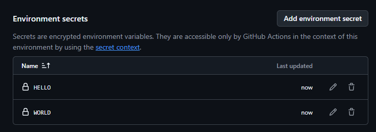
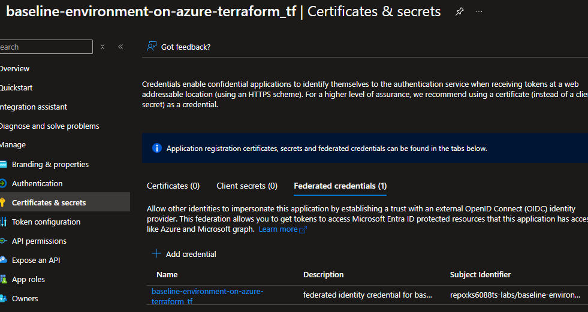

<!-- textlint-disable -->

[Microsoft Azure Tech Advent Calendar 2024](https://qiita.com/advent-calendar/2024/microsoft-azure-tech) の 12/13 の投稿記事です。

本記事では、GitHub Actions から OpenID Connect で Azure に接続する設定の自動化方法についてご紹介します。

---

# tl;dr

- GitHub Actions から OpenID Connect で Azure に接続する設定作業が面倒なのでシェルスクリプトで自動化しました。
- シェルスクリプトが辛くなったので Terraform で書き換えてみました。([integrations/github](https://registry.terraform.io/providers/integrations/github/latest), [hashicorp/azuread](https://registry.terraform.io/providers/hashicorp/azuread/latest/docs), [hashicorp/azurerm](https://registry.terraform.io/providers/hashicorp/azurerm/latest/docs) を利用)
- どこからでもデプロイできるように、GitHub Codespaces や GitHub Actions から手動実行もできるようにしました。
- スクリプトと Terraform のサンプルは [https://github.com/ks6088ts-labs/baseline-environment-on-azure-terraform](https://github.com/ks6088ts-labs/baseline-environment-on-azure-terraform) にて MIT ライセンスで公開しています。

---

# OpenID Connect を使って Azure に接続することのメリット

まず、`「GitHub Actions から OpenID Connect で Azure に接続する」`とはどういうことか説明します。

コードをホストする GitHub と、クラウドサービスを提供する Azure は、それぞれのサービスを連携させることができます。
GitHub Actions は GitHub が提供する CI/CD サービスで、GitHub リポジトリにプッシュされたコードを自動的にビルド・テスト・デプロイすることができます。Azure 上で動作するアプリケーションを GitHub Actions からテストしたりデプロイする場合、Azure に接続するための認証が必要になります。

Azure に接続するための認証方法として、種々の方法が提供されています。従来は、Azure のサービスプリンシパルを作成して、クライアントシークレットを使って認証する方法が一般的でしたが、セキュリティ上の理由から、OpenID Connect を使って認証する方法が推奨されています。

クライアントシークレットのような静的な認証情報はえてして有効期限が長く、漏洩した場合のリスクが高いです。また、キーの管理が煩雑になることもあります。  
そこで、OpenID Connect を使って認証する方法が推奨されています。OpenID Connect を使って認証する場合、静的な認証情報を使わずに一時的なトークンを使って認証を行います。このトークンは有効期限が短く、アクセス元や対象のリソース権限範囲を細かく制限できるため、漏洩してもリスクが低いため、OpenID Connect を使って認証する方法が推奨されています。

## 手動で GitHub Actions から OpenID Connect で Azure に接続する設定を行う

GitHub Actions から OpenID Connect で Azure に接続する設定作業は、手動で行うとざっくりと以下の流れになります。

**Azure Portal にて**

- アプリケーション登録する
- 登録したアプリケーションに対してフェデレーション資格情報を追加する
- ロール割り当てを行う

**GitHub にて**

- リポジトリに環境(=Environment)を作成する
- リポジトリで作成した環境上にシークレットを登録する

作業手順に関する記事は、[GitHub Actions を使用して Azure に接続する](https://learn.microsoft.com/azure/developer/github/connect-from-azure?tabs=azure-cli%2Clinux)が一次情報になります。  
恥ずかしながら私はそれでもよくわからなかったので、ググってみると[Check! GitHub Actions で OpenID Connect(OIDC) で Azure に安全に接続する](https://zenn.dev/dzeyelid/articles/5f20acbe549666)がヒットしました。GUI 操作のスクショ付きで具体的な操作手順が解説されており最高です。書いてある通り作業したらちゃんと設定できました、ありがたやありがたや。


## 課題: 手動の設定作業が面倒でミスが起きやすい

手動で設定できたのが嬉しい一方で、まぁまぁやること多いし基本的に不注意な人間なので、実はこの作業で何回かミスしました。Web UI はベンダー側の親切心のおかげで UI がどんどん改善されていくので、記事が古くなると操作手順が変わっていることもあります。

めんどくさくて正直もう二度とやりたくない気持ちではありますが、Azure x GitHub 環境で CI/CD 含めた、いわゆるちゃんとした開発をする場合、新しくプロジェクトを立ち上げる度にこの設定作業は不可避なはずです。
こういう時こそ将来の自分に向けて自動化しておくとコスパがいい！と思い自動化するモチベーションが湧きました。

## 対策: 自動化手法の検討

### シェルスクリプトで雑に自動化する

GUI 操作と一対一対応する処理を CLI で書き起こせばいいだけなので、シェルスクリプトで書いてみました。

この手の作業、一昔前までは私はググって解決していたのですが、ブラウザとエディタの切り替えがまぁまぁ思考速度を落とす原因になっておりました。
今の時代、この手の操作は [GitHub Copilot](https://github.com/features/copilot)にお任せするとエディタを行き来する必要も無いですし、チャットで聞くもよし、適当なファイル上でコメント補完の形で対話するもよしです。  
私は後者の手法をよく使います。やりかたは [GitHub Copilot パターン&エクササイズ > コメントからコードを生成](https://patterns.hattori.dev/ja/general/comment-to-code/) を参考にしています。

書いてみてそれなりに自動化は出来ました。

- [scripts/create-service-principal.sh](https://github.com/ks6088ts-labs/baseline-environment-on-azure-terraform/blob/v0.0.1/scripts/create-service-principal.sh): サービスプリンシパルを作成して資格情報・権限割り当てを実行するシェルスクリプト
- [scripts/configure-github-secrets.sh](https://github.com/ks6088ts-labs/baseline-environment-on-azure-terraform/blob/v0.0.1/scripts/configure-github-secrets.sh): GitHub の環境にシークレットを設定するシェルスクリプト

GitHub Copilot のおかげでシェルスクリプトを書くのもだいぶ楽になりました。
長ったらしいシェルスクリプトではありますが、実行環境の依存関係はコンパクトに纏まっているので身軽に使えそうです。
ただ、途中でエラーが起きたりした場合は手動で修正する必要があるので、完全な自動化とは言えません。再現性にも問題があるので他の人に自信を持って渡すことはできません。

### IaC ツールで

再現性とか冪等性が頭をよぎると、真っ先に IaC ツールを使いたくなります。
Azure 単体だと Bicep が使えるのですが、今回は GitHub, Azure, Microsoft Entra のリソース操作も必要です。統一的にコード管理をしたいので、今回はクロスプラットフォーム対応ができる Terraform で書いてみることにしました。
参考: [Terraform と Bicep の比較](https://learn.microsoft.com/azure/developer/terraform/comparing-terraform-and-bicep?tabs=comparing-bicep-terraform-integration-features#state-and-backend)

#### Terraform (HCL) で書いてみる

既にスクリプトがあるので、これを Terraform で書き換えてくださいと GitHub Copilot にお願いすると開発の初速は上がる場合が多いですが、コードベースがそこまで育ってない状態だと経験上あまり自分好みの書き方をしてくれない感じがあります。

結局書き方とか細かい好き嫌いを加味してコードを書き直すことが多いので、今回はまずは自分で書いてみることにしました。Visual Studio Code 上で開発する場合、VS Code 拡張として以下のものをインストールすると Terraform の開発が捗ります。いずれも HashiCorp が提供しているものです。

- [HashiCorp Terraform](https://marketplace.visualstudio.com/items?itemName=HashiCorp.terraform)
- [HashiCorp HCL](https://marketplace.visualstudio.com/items?itemName=HashiCorp.HCL)

自分の書くコードが信頼できないのでガードレールを敷くためにこれらもお勧めです。

**[TFLint](https://github.com/terraform-linters/tflint)**

静的解析ツール。未使用変数とかがあればこんな感じに怒ってくれる。

```
2 issue(s) found:

Warning: data "azuread_client_config" "client_config" is declared but not used (terraform_unused_declarations)

  on scenarios/create_user_group/main.tf line 26:
  26: data "azuread_client_config" "client_config" {

Reference: https://github.com/terraform-linters/tflint-ruleset-terraform/blob/v0.2.2/docs/rules/terraform_unused_declarations.md

Warning: data "azuread_service_principal" "msgraph" is declared but not used (terraform_unused_declarations)

  on scenarios/create_user_group/main.tf line 32:
  32: data "azuread_service_principal" "msgraph" {

Reference: https://github.com/terraform-linters/tflint-ruleset-terraform/blob/v0.2.2/docs/rules/terraform_unused_declarations.md

make: *** [Makefile:52: tflint] Error 2
Error: Process completed with exit code 2.
```

**[Tfsec](https://github.com/aquasecurity/tfsec)**

セキュリティの静的解析ツール。セキュリティに関するベストプラクティスに沿っていないコードを見つけてくれる。例えば以下のように、セキュリティに関する問題を指摘してくれます。

```
Results #1-4 HIGH Secret has plain text value (4 similar results)
```

## どこからでも使えるようにしたい

### GitHub Codespaces で動かせるようにする

ブラウザだけで動かせるとなお有難いので、GitHub Codespaces でも実行できるように Dev Container の設定も書いてみました。実際に書いた設定はこちら: [.devcontainer/devcontainer.json](https://github.com/ks6088ts-labs/baseline-environment-on-azure-terraform/blob/v0.0.1/.devcontainer/devcontainer.json)。  
[Dev Container Features](https://containers.dev/features) というコミュニティベースの拡張機能が充実していて、CLI ツールのインストール程度であれば、もはや Dockerfile すら書かなくてもよい感じです。
GitHub Codespace に対応しておけば、開発端末がなくても開発環境を構築できるので、開発環境の構築を手軽に行いたい場合に便利です。

### GitHub Actions の workflow_dispatch で手動実行できるようにする

実際に書いたワークフローはこちら: [.github/workflows/deploy.yml](https://github.com/ks6088ts-labs/baseline-environment-on-azure-terraform/blob/v0.0.1/.github/workflows/deploy.yml)
Environment の活用方法については、[GitHub Actions で環境(Environment)をパラメーターで指定する](https://aadojo.alterbooth.com/entry/2023/07/17/150000)が参考になりました。

GitHub Actions の環境(Environment) を使うと、同様の処理を異なる環境に対して実行できます。IT 管理者が開発環境やリソースを払い出す場合にも有用なのでは？と思います。

## 実装したシナリオの実行例

### [configure_github_secrets](https://github.com/ks6088ts-labs/baseline-environment-on-azure-terraform/tree/main/infra/scenarios/configure_github_secrets)

GitHub リポジトリに環境を作ってシークレットを設定する Terraform コードを書いてみました。以下はその一部です。

```hcl
# リポジトリの作成
resource "github_repository" "repository" {
  # https://stackoverflow.com/a/60231673/4457856
  count = var.create_github_repository ? 1 : 0

  name        = var.repository_name
  description = var.repository_description
  visibility  = var.repository_visibility
}

# GitHub リポジトリの環境を作成
resource "github_repository_environment" "repository_environment" {
  environment         = var.environment_name
  repository          = local.repository_name
  prevent_self_review = true
  deployment_branch_policy {
    protected_branches     = true
    custom_branch_policies = false
  }
}

# GitHub リポジトリの環境にシークレットを設定
resource "github_actions_environment_secret" "actions_environment_secret" {
  for_each = { for secret in var.actions_environment_secrets : secret.name => secret }

  repository      = local.repository_name
  environment     = github_repository_environment.repository_environment.environment
  secret_name     = each.value.name
  plaintext_value = each.value.value
}
```

上記コードを実行すると、GitHub リポジトリを作成し、リポジトリに環境を作成し、環境にシークレットを設定します。GitHub CLI の認証情報を利用します。

```shell
# リポジトリをクローン
git clone git@github.com:ks6088ts-labs/baseline-environment-on-azure-terraform.git

# ディレクトリに移動
cd baseline-environment-on-azure-terraform/infra/scenarios/configure_github_secrets/

# GitHub CLI でログイン
gh auth login

# Terraform の初期化
terraform init

# リソースの作成
terraform apply -auto-approve
# Plan: 3 to add, 0 to change, 0 to destroy.
# github_repository_environment.repository_environment: Creating...
# github_repository_environment.repository_environment: Creation complete after 1s [id=baseline-environment-on-azure-terraform:tf]
# github_actions_environment_secret.actions_environment_secret["WORLD"]: Creating...
# github_actions_environment_secret.actions_environment_secret["HELLO"]: Creating...
# github_actions_environment_secret.actions_environment_secret["WORLD"]: Creation complete after 5s [id=baseline-environment-on-azure-terraform:tf:WORLD]
# github_actions_environment_secret.actions_environment_secret["HELLO"]: Creation complete after 5s [id=baseline-environment-on-azure-terraform:tf:HELLO]

# Apply complete! Resources: 3 added, 0 changed, 0 destroyed.
```

GitHub リポジトリに環境が作成され、環境にシークレットが設定されていることが確認できます。



### [create_service_principal](https://github.com/ks6088ts-labs/baseline-environment-on-azure-terraform/tree/main/infra/scenarios/create_service_principal)

Microsoft Entra ID に新しいアプリケーションとサービスプリンシパルを作成し、必要なリソースアクセス権やロールを割り当てています。
GitHub Actions 連携用のフェデレーション認証設定と、ローカル開発用のクライアントシークレットも作成しています。

```shell
# ディレクトリに移動
cd baseline-environment-on-azure-terraform/infra/scenarios/create_service_principal/

# Azure CLI でログイン
az login

# (Optional) 現在ログインしているアカウントを確認
az ad signed-in-user show

# Terraform で利用される環境変数を設定
export ARM_SUBSCRIPTION_ID=$(az account show --query id --output tsv)
export TF_VAR_service_principal_name="baseline-environment-on-azure-terraform_tf"
export TF_VAR_github_environment="tf"

# Terraform の初期化
terraform init

# リソースの作成
terraform apply -auto-approve
```

Microsoft Entra ID に新しいアプリケーションとサービスプリンシパルが作成され、必要なリソースアクセス権やロールが割り当てられていることが確認できます。



