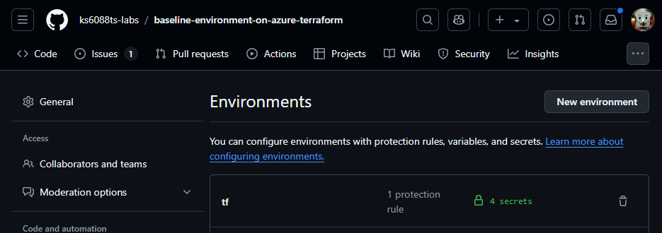

<!-- textlint-disable -->

[Microsoft Azure Tech Advent Calendar 2024](https://qiita.com/advent-calendar/2024/microsoft-azure-tech) の 12/13 の投稿記事です。

本記事では、GitHub Actions から OpenID Connect で Azure に接続する設定作業を Terraform で自動化する方法についてご紹介します。

<!--truncate-->

## TL;DR

- GitHub Actions から OpenID Connect で Azure に接続する設定作業を Terraform で自動化しました。
- GitHub Codespaces や GitHub Actions からリソースをデプロイできるようにしました。
- スクリプトと Terraform のサンプルは [こちら](https://github.com/ks6088ts-labs/baseline-environment-on-azure-terraform) にて MIT ライセンスで公開しています。

---

## 全体構成

### OpenID Connect 接続設定の自動化

GitHub Actions から OpenID Connect で Azure に接続する設定を自動化した処理の流れは以下の通りです。ローカル開発環境から、GitHub と Azure プラットフォーム上に接続に必要な設定を Terraform で作成しています。


### OpenID Connect 接続で GitHub Actions から Azure にリソースをデプロイ

払い出された接続設定を利用して、GitHub Actions から OpenID Connect で Azure に接続し、Azure のリソースを払い出す全体の流れは以下の通りです。
GitHub Actions の Environment を利用すると、異なる環境に対して同じ処理を実行できて便利です。


## OpenID Connect で Azure に接続する設定作業を手動で行う

### なぜ OpenID Connect を使って Azure に接続するのか

まず、`「GitHub Actions から OpenID Connect で Azure に接続する」`とはどういうことか説明します。

コードをホストする GitHub と、クラウドサービスを提供する Azure は、それぞれのサービスを連携させることができます。
GitHub Actions は GitHub が提供する CI/CD サービスで、GitHub リポジトリにプッシュされたコードを自動的にビルド・テスト・デプロイすることができます。Azure 上で動作するアプリケーションを GitHub Actions からテストしたりデプロイする場合、Azure に接続するための認証が必要になります。

Azure に接続するための認証方法として、種々の方法が提供されています。従来は、Azure のサービスプリンシパルを作成して、クライアントシークレットを使って認証する方法が一般的でしたが、セキュリティ上の理由から、OpenID Connect を使って認証する方法が推奨されています。

クライアントシークレットのような静的な認証情報はえてして有効期限が長く、漏洩した場合のリスクが高いです。また、キーの管理が煩雑になることもあります。  
そこで、OpenID Connect を使って認証する方法が推奨されています。OpenID Connect を使って認証する場合、静的な認証情報を使わずに一時的なトークンを使って認証を行います。このトークンは有効期限が短く、アクセス元や対象のリソース権限範囲を細かく制限できるため、漏洩してもリスクが低いため、OpenID Connect を使って認証する方法が推奨されています。

OpenID Connect を利用するメリットに関しては、[GitHub CI/CD 実践ガイド――持続可能なソフトウェア開発を支える GitHub Actions の設計と運用 エンジニア選書](https://amzn.to/3Co02xA) の `第11章　OpenID Connectによるセキュアなクラウド連携` が参考になります。

### 手動での接続設定は手間がかかるしミスが起きやすい

GitHub Actions から OpenID Connect で Azure に接続する設定作業は、手動で行うとざっくりと以下の流れになります。

**Azure Portal にて**

- アプリケーション登録する
- 登録したアプリケーションに対してフェデレーション資格情報を追加する
- ロール割り当てを行う

**GitHub にて**

- リポジトリに環境(=Environment)を作成する
- リポジトリで作成した環境上にシークレットを登録する

作業手順に関する記事は、[GitHub Actions を使用して Azure に接続する](https://learn.microsoft.com/azure/developer/github/connect-from-azure?tabs=azure-cli%2Clinux)が一次情報になります。  
恥ずかしながら私はそれでもよくわからなかったので、ググってみると[Check! GitHub Actions で OpenID Connect(OIDC) で Azure に安全に接続する](https://zenn.dev/dzeyelid/articles/5f20acbe549666)がヒットしました。GUI 操作のスクショ付きで具体的な操作手順が解説されており最高です。


書いてある通り作業したらちゃんと設定できました。
手動で設定できたのが嬉しい一方で、手動で設定するのは面倒ですしミスが起きやすいです。
実際、この作業を行う過程で何回かミスをしてしまいました。

## 面倒で繰り返す作業は自動化すべし

この手の作業を手動で設定するのは面倒ですしミスが起きやすいです。  
Azure x GitHub 環境で CI/CD 含めた、いわゆるちゃんとした開発をする場合、新しくプロジェクトを立ち上げる度にこの設定作業を繰り返すことになります。
こういう時こそ将来の自分に向けて自動化しておくとコスパがいい！と思い自動化するモチベーションが湧きました。

### アプローチ 1. スクリプトを書いて自動化する

Azure Portal などの Web UI はベンダー側の親切心のおかげで、見た目や操作手順は変化する場合があります。
スクリーンショットを使った手順書は、初心者でも凄くわかりやすい反面、UI が変わるたびに更新が必要になります。  
一方で、フロントエンドが内部的にコールしている API は基本的に後方互換性が保たれることが多いため、API を使った自動化は保守性に優れています。
`GUI は変わるが API は変わらない` という考え方は、自動化の観点からは重要です。

操作手順を自動化するアプローチとして、正攻法としては UI 操作に対応する API をドキュメントや Copilot を使って調べ、CLI のコマンドやスクリプトに書き起こすことが考えられます。

場合に依ってはドキュメントがない場合もあります。その場合はその手順を実行した際のリクエストを以下に示すブラウザのツールを使ってキャプチャし、それを元にスクリプトを書くことができます。(挙動が読めないので推奨は出来ないですが)

| ブラウザ       | リンク                                                                                                                 |
| -------------- | ---------------------------------------------------------------------------------------------------------------------- |
| Microsoft Edge | [ネットワーク アクティビティの検査](https://learn.microsoft.com/ja-jp/microsoft-edge/devtools-guide-chromium/network/) |
| Google Chrome  | [ネットワーク パネルの使用](https://developer.chrome.com/docs/devtools/network?hl=ja)                                  |

スクリプトへの書き起こしは一昔前まではウェブ検索して解決していましたが、今は [GitHub Copilot](https://github.com/features/copilot)にお任せすると早いです。チャットで聞くもよし、適当なファイル上でコメント補完の形で対話するもよしです。  
私は後者の手法をよく使います。やりかたは [GitHub Copilot パターン&エクササイズ > コメントからコードを生成](https://patterns.hattori.dev/ja/general/comment-to-code/) を参考にしています。シェルスクリプトで目標としていた Azure と GitHub の設定を自動化するためのスクリプトを書いてみました。

- [scripts/create-service-principal.sh](https://github.com/ks6088ts-labs/baseline-environment-on-azure-terraform/blob/v0.0.1/scripts/create-service-principal.sh): サービスプリンシパルを作成して資格情報・権限割り当てを実行するシェルスクリプト
- [scripts/configure-github-secrets.sh](https://github.com/ks6088ts-labs/baseline-environment-on-azure-terraform/blob/v0.0.1/scripts/configure-github-secrets.sh): GitHub の環境にシークレットを設定するシェルスクリプト

長ったらしいシェルスクリプトではありますが、実行環境の依存関係はコンパクトに纏まっているので身軽に使えそうです。
ただ、途中でエラーが起きたりした場合は手動で修正する必要があるので、完全な自動化とは言えません。再現性にも問題があるので他の人に自信を持って渡すことはできません。

### アプローチ 2. IaC ツールを利用して自動化する

手順が複雑で重厚長大な成果物を他者に渡す場合は IaC ツールを利用することが多いです。
シェルスクリプトに比べると書くのに手間がかかりますが、再現性や保守性が高いので他者に渡す場合は IaC ツールを利用することが多いです。
IaC ツールとしては大きく Bicep, Terraform などが考えられます。
今回のユースケースにおいては、Azure と GitHub のリソースを管理する必要があるため Terraform が適していると思います。
[Terraform と Bicep の比較](https://learn.microsoft.com/ja-jp/azure/developer/terraform/comparing-terraform-and-bicep?tabs=comparing-bicep-terraform-integration-features#infrastructure-targets) が参考になります。

## Terraform で書いてみる

各プラットフォーム向けに以下のプロバイダが提供されています。

| プラットフォーム             | プロバイダ                                                                                 |
| ---------------------------- | ------------------------------------------------------------------------------------------ |
| GitHub                       | [integrations/github](https://registry.terraform.io/providers/integrations/github/latest)  |
| Microsoft Entra ID(Azure AD) | [hashicorp/azuread](https://registry.terraform.io/providers/hashicorp/azuread/latest/docs) |
| Azure                        | [hashicorp/azurerm](https://registry.terraform.io/providers/hashicorp/azurerm/latest/docs) |

### 開発環境を整える

Visual Studio Code 上で開発する場合、VS Code 拡張として以下のものをインストールすると Terraform の開発が捗ります。いずれも HashiCorp が提供しているものです。

| 拡張機能名                                 | リンク                                                                                         |
| ------------------------------------------ | ---------------------------------------------------------------------------------------------- |
| Terraform Extension for Visual Studio Code | [HashiCorp Terraform](https://marketplace.visualstudio.com/items?itemName=HashiCorp.terraform) |
| HCL Extension for Visual Studio Code       | [HashiCorp HCL](https://marketplace.visualstudio.com/items?itemName=HashiCorp.HCL)             |

### 静的解析を導入する

Terraform のコードに静的解析ツールを導入しておくと、コードの品質を保つのに役立ちます。今回は以下のツールを導入してみました。

#### **[TFLint](https://github.com/terraform-linters/tflint)**

静的解析ツール。未使用変数とかがあると教えてくれます。例えば以下のように、未使用のデータソースがあることを指摘してくれます。

```
2 issue(s) found:

Warning: data "azuread_client_config" "client_config" is declared but not used (terraform_unused_declarations)

  on scenarios/create_user_group/main.tf line 26:
  26: data "azuread_client_config" "client_config" {

Reference: https://github.com/terraform-linters/tflint-ruleset-terraform/blob/v0.2.2/docs/rules/terraform_unused_declarations.md

Warning: data "azuread_service_principal" "msgraph" is declared but not used (terraform_unused_declarations)

  on scenarios/create_user_group/main.tf line 32:
  32: data "azuread_service_principal" "msgraph" {

Reference: https://github.com/terraform-linters/tflint-ruleset-terraform/blob/v0.2.2/docs/rules/terraform_unused_declarations.md

make: *** [Makefile:52: tflint] Error 2
Error: Process completed with exit code 2.
```

#### **[Trivy](https://github.com/aquasecurity/trivy)**

Trivy はコンテナイメージの脆弱性スキャンツールですが、Terraform のコードにも適用できます。  
セキュリティに関するベストプラクティスに沿っていないコードを指摘してくれます。

#### **[tfsec](https://github.com/aquasecurity/tfsec)**

セキュリティの静的解析ツールですが、現在は非推奨で Trivy に移行することが推奨されています。  
[tfsec is joining the Trivy family #1994](https://github.com/aquasecurity/tfsec/discussions/1994) によると、tfsec は 2023 年 2 月に Aqua Security 社に買収されており、Trivy ファミリに組み込まれることが発表されています。
[tfsec から Trivy に移行した話](https://zenn.dev/acntechjp/articles/9f0e3d4813e36d#tfsec%E3%81%AE%E7%8F%BE%E7%8A%B6) や [Trivy へのマイグレーションガイド](https://github.com/aquasecurity/tfsec/blob/master/tfsec-to-trivy-migration-guide.md)が出ている状況も鑑みますと、今後は Trivy を使っていくのが良さそうです。

## どこからでも動かせるようにする

### GitHub Codespaces

ブラウザだけで動かせるとなお有難いので、GitHub Codespaces でも実行できるように Dev Container の設定も書いてみました。実際に書いた設定はこちら: [.devcontainer/devcontainer.json](https://github.com/ks6088ts-labs/baseline-environment-on-azure-terraform/blob/v0.0.1/.devcontainer/devcontainer.json)。  
[Dev Container Features](https://containers.dev/features) というコミュニティベースの拡張機能が充実していて、CLI ツールのインストール程度であれば、もはや Dockerfile すら書かなくてもよい感じです。
GitHub Codespace に対応しておけば、開発端末がなくても開発環境を構築できるので、開発環境の構築を手軽に行いたい場合に便利です。

### GitHub Actions の `workflow_dispatch`

ブラウザから GitHub Actions の手動実行を行うためには、`workflow_dispatch` イベントを利用します。
実際に書いたワークフローは [.github/workflows/deploy.yml](https://github.com/ks6088ts-labs/baseline-environment-on-azure-terraform/blob/v0.0.1/.github/workflows/deploy.yml) です。

Environment の活用方法については、[GitHub Actions で環境(Environment)をパラメーターで指定する](https://aadojo.alterbooth.com/entry/2023/07/17/150000)が参考になりました。
GitHub Actions の環境(Environment) を使うと、同様の処理を異なる環境に対して実行できます。IT 管理者が開発環境やリソースを払い出す場合にも有用なのでは？と思います。

## 実行例

実際に GitHub Actions を使用して OpenID Connect で Azure に接続する設定を自動化した Terraform (HCL) コードを実行してみます。

```shell
# リポジトリをクローン
git clone git@github.com:ks6088ts-labs/baseline-environment-on-azure-terraform.git
```

### 1. サービスプリンシパルを作成し、OpenID Connect を設定して Azure に認証します。

以下の処理を Terraform で実行します。

- Microsoft Entra ID に新しいアプリケーションとサービスプリンシパルを作成
- 必要なリソースアクセス権やロールを割り当てる
- GitHub Actions 連携用のフェデレーション認証設定の払い出し
- ローカル開発用のクライアントシークレット作成

```shell
# ディレクトリに移動
cd infra/scenarios/create_service_principal

# Azure CLI でログイン
az login

# (オプション) 現在ログインしているアカウントを確認
az ad signed-in-user show

# Terraform で利用される環境変数を設定
export ARM_SUBSCRIPTION_ID=$(az account show --query id --output tsv)
export TF_VAR_service_principal_name="baseline-environment-on-azure-terraform_tf"
export TF_VAR_github_environment="tf"

# Terraformの設定を初期化
terraform init

# リソースの作成
terraform apply -auto-approve
```

想定通りリソースが作成できているか Azure Portal から確認してみます。
以下では API のアクセス許可設定が確認できます。(管理者の同意は未実施)


GitHub 向けのフェデレーション認証設定が確認できます。


アプリケーションに権限を付与するためには管理者の同意が必要です。
対象となるアプリケーションのオブジェクト ID は output で出力しておりますので、以下のコマンドで管理者の同意を実施できます。

```shell
# アプリケーションに権限を付与
application_object_id=$(terraform output -raw application_object_id)
az ad app permission admin-consent --id $application_object_id
```

### 2. GitHub シークレットを設定

GitHub CLI の認証情報を利用して、以下の処理を Terraform で実行します。

- GitHub リポジトリの作成
- リポジトリに環境を作成
- 作成した環境にシークレットを設定

1 で作成した Azure の設定を利用して GitHub にシークレットを設定するため、`terraform.tfvars` に Azure の設定を記述します。

```shell
# ディレクトリに移動
cd infra/scenarios/configure_github_secrets/

# Azure CLI でログイン
az login

# (オプション) 現在ログインしているアカウントを確認
az ad signed-in-user show

# 作成したアプリケーションの情報を取得
APPLICATION_NAME="baseline-environment-on-azure-terraform_tf"
APPLICATION_ID=$(az ad sp list --display-name "$APPLICATION_NAME" --query "[0].appId" --output tsv)
SUBSCRIPTION_ID=$(az account show --query id --output tsv)
TENANT_ID=$(az account show --query tenantId --output tsv)

# terraform.tfvars に Azure の設定を記述
cat <<EOF > terraform.tfvars
create_github_repository = "false"
organization = "ks6088ts-labs"
repository_name = "baseline-environment-on-azure-terraform"
environment_name = "tf"
actions_environment_secrets = [
    {
        name  = "ARM_CLIENT_ID"
        value = "$APPLICATION_ID"
    },
    {
        name  = "ARM_SUBSCRIPTION_ID"
        value = "$SUBSCRIPTION_ID"
    },
    {
      name  = "ARM_TENANT_ID"
      value = "$TENANT_ID"
    },
    {
      name  = "ARM_USE_OIDC"
      value = "true"
    },
]
EOF
```

上記の設定を利用して、以下の処理を Terraform で実行します。
Terraform で GitHub リポジトリに環境を作成し、環境にシークレットを設定します。

```shell
# ディレクトリに移動
cd infra/scenarios/configure_github_secrets/

# GitHub CLI でログイン
gh auth login

# (オプション) 現在ログインしているアカウントを確認
gh auth status

# Terraform の初期化
terraform init

# リソースの作成
terraform apply -auto-approve
```

GitHub リポジトリに環境が作成され、環境にシークレットが設定されていることが確認できます。



### 3. GitHub Actions から OpenID Connect で Azure に接続してみる

手順 1, 手順 2 で作成した設定を利用して、GitHub Actions から OpenID Connect で Azure に接続してみます。

[.github/workflows/deploy.yml](https://github.com/ks6088ts-labs/baseline-environment-on-azure-terraform/blob/v0.0.1/.github/workflows/deploy.yml) に GitHub Actions のワークフローが定義されています。

GitHub Actions では、input を受け取ることができます。以下のように `scenario` と `environment` を指定することで、デプロイ対象のシナリオと環境を選択してワークフローを実行できます。

```yaml
on:
  workflow_dispatch:
    inputs:
      # デプロイ対象のシナリオを選択
      scenario:
        type: string
        required: true
        description: "Scenario to deploy"
        default: "tfstate_backend"
      # 環境を選択
      environment:
        type: environment
        required: true
        description: "Environment to deploy"
        default: "ci"
```

上記の設定を作成すると、GitHub のウェブ UI から以下のように手動でワークフローを実行できます。


実行対象の環境と、環境変数を設定します。

```yaml
environment: ${{ github.event.inputs.environment }}
env:
  ARM_CLIENT_ID: ${{ secrets.ARM_CLIENT_ID }}
  ARM_SUBSCRIPTION_ID: ${{ secrets.ARM_SUBSCRIPTION_ID }}
  ARM_TENANT_ID: ${{ secrets.ARM_TENANT_ID }}
  ARM_USE_OIDC: ${{secrets.ARM_USE_OIDC}}
```

接続に成功すると、Azure にリソースがデプロイされます。実行結果は以下のようになります。


## まとめ

本記事では GitHub Actions から OpenID Connect で Azure に接続する設定を Terraform で自動化する方法についてご紹介しました。  
開発者の手元で環境構築する手間を省くことができるため、開発者が本来やるべき開発に集中できるようになります。また、手動で設定する場合に比べてミスが起きにくくなり、OpenID Connect を使って認証することでセキュリティリスクを軽減できています。  
また、GitHub Actions から Azure にリソースをデプロイする構成の利用ケースとして、事業部門が Entra ディレクトリを提供サービス用に外出ししているケースにおいて、開発者がオペレーターを兼ねてる場合などで有用であると考えられます。
