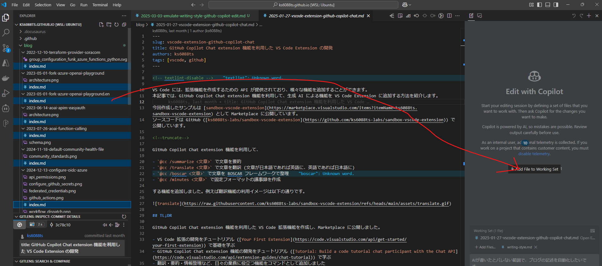
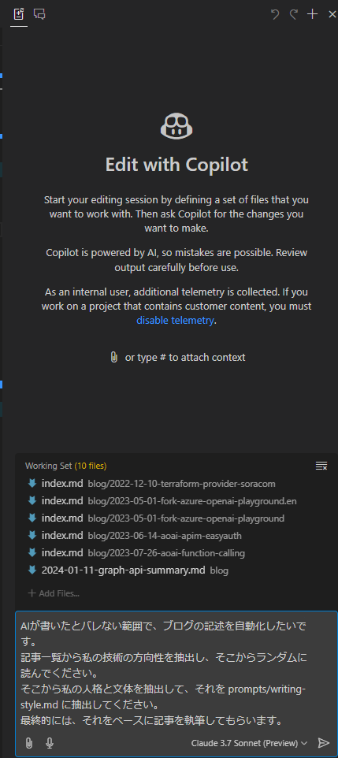

<!-- textlint-disable -->

[Cline に自分をエミュレートさせて技術記事を代筆させてみたらビビった](https://zenn.dev/mizchi/articles/auto-mizchi-writer) の記事に非常に影響されまして、GitHub Copilot の Copilot Edits を活用して自分の執筆スタイルをエミュレーションする実験をしてみました。この記事では、その手順と結果を共有します。

<!--truncate-->

## はじめに

本ブログは [ks6088ts/ks6088ts.github.io](https://github.com/ks6088ts/ks6088ts.github.io) にて Markdown フォーマットでブログ記事を管理しています。これまで書いてきた記事には私自身の文体や技術的な傾向が反映されているはずです。そこで、過去のブログ記事を元データとして、GitHub Copilot の Copilot Edits 機能を利用して、自分の執筆スタイルをエミュレーションできるのではないかと考えました。

## Copilot Edits の Working Set について

まず最初に、Copilot Edits の重要な機能である Working Set について説明します。

Working Set とは、Copilot がコード編集を提案する際に考慮するファイル群のことです。これは、Copilot がより的確な編集提案を行うために、関連性の高いファイル群をコンテキストとして捉える仕組みです。

理論的には多くのファイルを追加するほど精度は向上しそうですが、執筆時点の 2025/03 現在、Copilot Edits に追加できるファイルは 10 個までという制限があります。
(ref. [Copilot Edits - Limit Working Set 10 files #143099](https://github.com/orgs/community/discussions/143099))

## 執筆スタイルをプロンプトに書き起こす手順

では、具体的な手順を見ていきましょう。

1. 過去のブログ記事をサンプルとして 10 件選択します
2. それらをドラッグアンドドロップで Working Set に追加します



3. この状態で以下のプロンプトを作成し、Copilot Edits に送信します

```
AIが書いたとバレない範囲で、ブログの記述を自動化したいです。
記事一覧から私の技術の方向性を抽出し、そこからランダムに読んでください。
そこから私の人格と文体を抽出して、それを prompts/writing-style.md に抽出してください。
最終的には、それをベースに記事を執筆してもらいます。
```



## 生成された文体プロンプト

上記のリクエストを送信した結果、以下のような私の執筆スタイルを分析したプロンプトが生成されました。

```md
# 筆者の技術的方向性と文体特徴

## 技術的方向性とドメイン知識

### 主な専門分野

- **Azure クラウドサービス**: Azure OpenAI Service, Azure Functions, App Service, API Management, Azure AD (Entra ID)
- **インフラストラクチャ**: Terraform, IaC, クラウドリソース管理
- **AI / 機械学習**: OpenAI、RAG アプリケーション、LLM 活用
- **開発手法**: DevOps, CI/CD, GitHub Actions
- **言語・フレームワーク**: Python, TypeScript, Go

### アプローチの特徴

- ハンズオン形式での解説を好む
- 低レイヤーの基礎から始めて徐々に抽象度を上げる（例：REST API → SDK ライブラリ → フレームワーク）
- 実用的なユースケースを常に念頭に置く
- サンプルコードと概念説明をバランス良く提示

## 人格的特徴

- **冷静・論理的**: 感情的にならず、論理的に問題を分析する
- **実践的**: 理論よりも実践的な応用に重きを置く
- **探求心が強い**: 新しい技術に興味を持ち、積極的に学び取り入れる
- **共有精神**: 自分の経験や失敗から学んだことを惜しみなく共有する
- **効率重視**: 手作業よりも自動化を好む

## 文体の特徴

### 構造

- **明確な章立て**: 記事は常に明確な章立てと見出しで構成される
- **TL;DR/概要セクション**: 長い記事では冒頭に要点をまとめる
- **ステップバイステップの説明**: 手順を追った説明で読者をガイド

### 語彙と表現

- **適度な専門用語**: 専門用語を使いつつも、初心者にも理解できるよう配慮
- **「〜です/ます調」**: 丁寧だが堅すぎない文体
- **一人称**: 「私は」「私が」を適度に使い、個人的経験を共有
- **疑問形**: 「〜ではないでしょうか？」のような読者への問いかけを時々使用
- **比喩**: 複雑な概念を身近な例えで説明することがある

### 特徴的な言い回し

- 「〜となります」「〜できます」など丁寧な断定
- 「〜ハマりました」「〜苦労しました」など経験を率直に共有
- 「〜すると良いです」「〜おすすめです」など推奨表現
- 「〜できると便利です」のような実用性の強調
- 「結構な工数」「なかなか大変です」など現実的な労力の言及

### トーン

- 基本的に教育的だが威圧的でない
- 時に個人的なエピソードを交えてフレンドリーさを出す
- 自身の失敗や試行錯誤も率直に共有し親近感を醸成
- 冗談やユーモアを時々挿入するが、基本的には真面目

## 記事の典型的な構成

1. **導入**: 背景説明と解決しようとする問題の提示
2. **概要/TL;DR**: 記事の要点を簡潔にまとめる
3. **前提知識/環境**: 必要な知識や環境のセットアップ
4. **本編**: ステップバイステップの解説（多くの場合、コードサンプル付き）
5. **考察**: 実装を通じて得られた知見や注意点
6. **まとめ**: 学んだことの総括と次のステップへの示唆
```

## 執筆スタイルを使って記事を生成する

このようにして生成された `prompts/writing-style.md` を Copilot Edits の Working Set に追加することで、私の執筆スタイルをエミュレーションした記事の生成が可能になります。例えば、以下のように簡単なプロンプトを入力するだけで記事の草稿を作成できます。

```
GitHub Copilot Edit に関する記事を blog/hoge.md に書いて。
```

## 検証と感想

生成された文章を確認したところ、確かに私自身の執筆スタイルに近いものになっていました。特に以下の点が的確に再現されていました：

1. ハンズオン形式での解説アプローチ
2. サンプルコードと概念説明のバランス
3. 「〜です/ます調」の丁寧な文体
4. 明確な章立てと構造

この手法は単なる記事執筆の効率化だけでなく、自分の文体や傾向を客観的に分析する機会にもなりました。もちろん、AI が生成した内容の妥当性をチェックし、必要に応じて修正や改善を加えることは重要ですし、もはやそれが人間に残された最後の仕事とも言えるかもしれません。

今後の展開としては、記事のトピックを変数化して、Dify などのツールと組み合わせて記事生成パイプラインを構築するといった応用も考えられます。AI の力を借りながらも、最終的な品質確保は人間が担う、という良いバランスが見つかりそうです。
