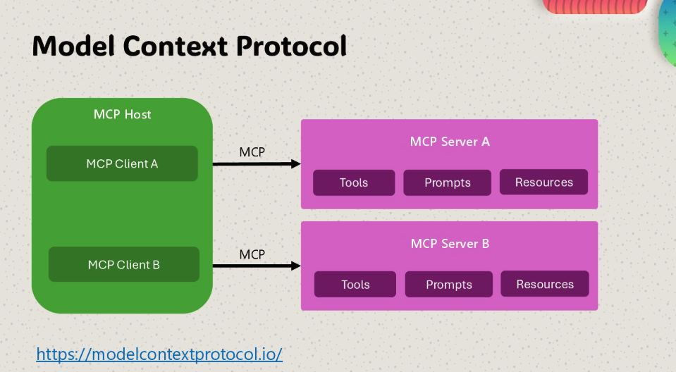
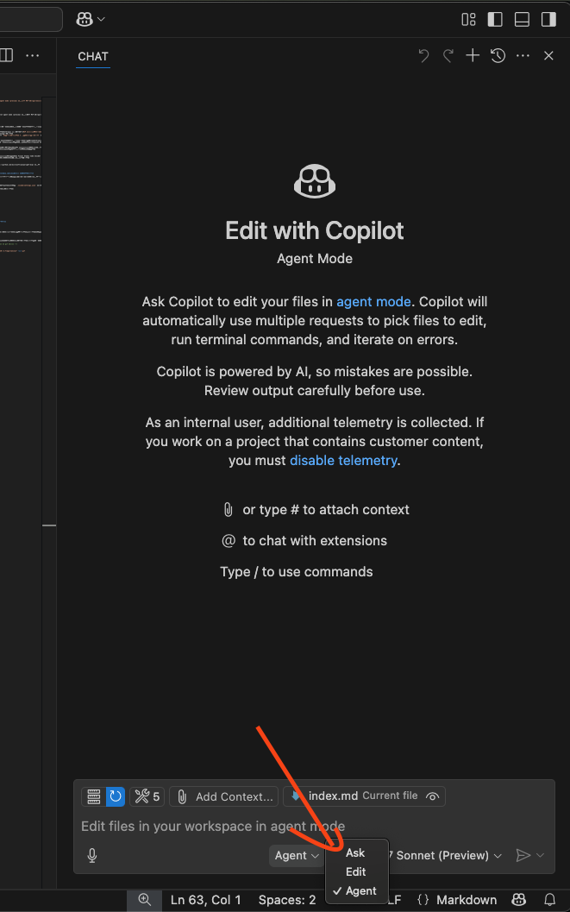
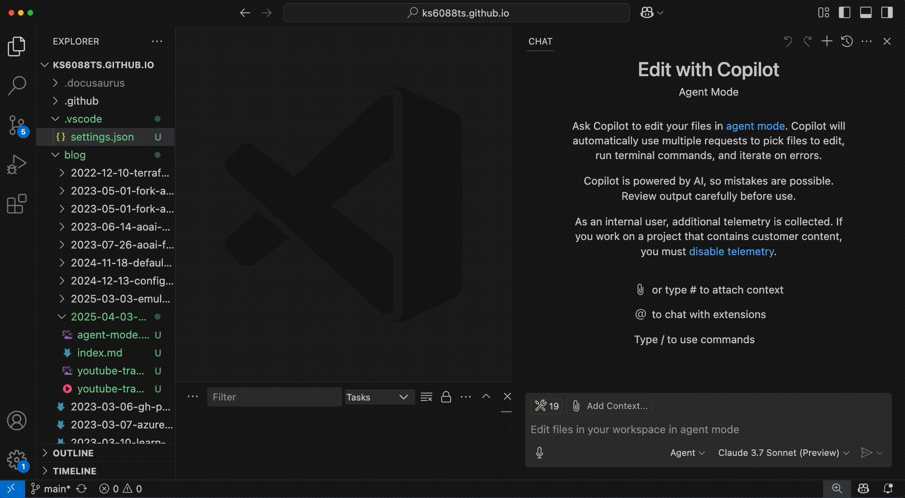

<!-- textlint-disable -->

本記事では Visual Studio Code Insiders と GitHub Copilot agent mode (preview) を使用して MCP サーバーを活用する方法について説明します。

<!--truncate-->

---

## MCP とは？

MCP (Model Context Protocol) は、AI モデルとアプリケーション間のインタラクションを標準化するためのプロトコルです。
ざっくりしたイメージ図は以下のような感じです。


(※出典: [Enterprise AI in 2025?](https://speakerdeck.com/pamelafox/enterprise-ai-in-2025?slide=5))

MCP の概要を理解するために、まずは一次情報にあたります。Anthropic が出している[MCP の公式ドキュメント](https://modelcontextprotocol.io/introduction)を参照することをお勧めします。
(※関連文献は英語の記事が多いですが、ChatGPT などの AI を使って `猫でもわかるように 3 行で日本語でまとめて` と聞いてみると、意外と良い感じに要約してくれます。)

MCP は、AI モデルとアプリケーション間のインタラクションを標準化するためのプロトコルであり、Anthropic が開発したものです。MCP を使用することで、AI モデルとアプリケーション間の通信が効率化され、開発者はより簡単に AI モデルを利用できるようになります。

ウェブ上の記事を見ると仰々しいこと書かれてることが結構あるんですが、実装する上では単に JSON RPC をする標準化されたプロトコルという認識でも今のところ困らない感じがします。
これまで Function Calling とか Tool calling とか言われてたものが MCP という形で標準化されて互換性が持たせやすくなったというくらいの認識です。(あくまで個人の感想 & 明日になったら違うこと言ってるかもしれないので、あまり鵜呑みにしないでください。)

今後、ツールベンダーは MCP に準拠したツールを作成し、開発者はそれらのツールを利用して AI モデルと連携することができる世界に徐々に移行していくのではないかと思います。

---

## MCP を使ってみる

読むだけだとどのぐらい便利なものかの解像度がそこまで上がらないので、次は Visual Studio Code Insiders と GitHub Copilot agent mode (preview) を使用して MCP サーバ、クライアントを実際に使ってみます。(※ 2025/04 現在、Visual Studio Code Insiders でしか使えないので Insiders 版を使っています。)

GitHub Copilot agent mode 以外にも、MCP クライアントアプリケーションとして振る舞えるアプリとして [Claude Desktop](https://claude.ai/download) や [Cline](https://cline.bot/) などもあります。

### ブラウザを操作する MCP サーバー

Microsoft がオープンソースで出している [Playwright MCP server](https://github.com/microsoft/playwright-mcp) を使うと、LLM を使ってブラウザを操作することができます。
まずは何もコードを書かずにとりあえず動かして味見をしてみます。

手順は以下の通りです。

**1. [Visual Studio Code Insiders](https://code.visualstudio.com/insiders/) をインストール**

公式サイトからインストーラをダウンロードしてインストールするもよし、パッケージマネージャーを使うもよし、好きな方法でインストールしてください。

**2. 設定ファイルを作成する**

適当なディレクトリで Visual Studio Code Insiders を開いて、以下の内容で `.vscode/settings.json` を作成します。

注意:

- npx を使うので、Node.js がインストールされている必要があります
- headless だと挙動が見えないので `--vision` オプションを付けています

```json
{
  "mcp": {
    "servers": {
      "playwright": {
        "command": "npx",
        "args": ["-y", "@playwright/mcp@latest", "--vision"]
      }
    }
  }
}
```

**3. GitHub Copilot Chat の画面から Agent Mode を選択する**



**4. チャット経由で　 Web 検索してみる**

Web ブラウザの操作が必要な指示を与えると、GitHub Copilot Chat から MCP Server への API 呼び出しの確認が走り、許可するとブラウザが起動します。



---

## MCP サーバを作ってみる

次は MCP サーバを自分で作ってみます。
まずは[公式 SDK の README](https://github.com/modelcontextprotocol/python-sdk/blob/main/README.md) にあるクイックスタートを読んで、最低限の依存関係とサンプルコードを実行して全容を把握すると良いです。

基本的には MCP 関連パッケージをインストールして以下のようなコードを書くだけで MCP サーバを立てることができます。

```python
# server.py
from mcp.server.fastmcp import FastMCP

mcp = FastMCP("My App")

if __name__ == "__main__":
    mcp.run()
```

```shell
# ライブラリのインストール
pip install "mcp[cli]"

# サーバの起動
python server.py
```

他にもサーバー開発のクイックスタートは [Model Context Protocol > Quickstart > For Server Developers](https://modelcontextprotocol.io/quickstart/server) に詳しく書いてあります。

### YouTube 動画のトランスクリプト API を叩く MCP サーバ

ここでは例として、YouTube 動画のトランスクリプトを取得する MCP サーバを実装します。このサーバーを通じて、LLM が直接 YouTube 動画の内容を理解できるようになります。

基本的な実装手順は以下の通りです：

1. YouTube Transcript API をインストール
2. MCP サーバーの基本フレームワークを構築
3. トランスクリプト取得のためのツール定義
4. リクエストハンドラの実装

[YouTube Transcript API](https://github.com/jdepoix/youtube-transcript-api) を利用することで、面倒なスクレイピング処理を書くことなく簡単にトランスクリプトを取得できます。パッケージのインストールは以下のコマンドで行います：

```bash
pip install youtube-transcript-api mcp
```

MCP サーバーの実装は、基本的なテンプレートから始めて機能を追加していく形になります。以下は実装の核となる部分の抜粋です：

```python
from mcp.server.fastmcp import FastMCP
from youtube_transcript_api import YouTubeTranscriptApi
from youtube_transcript_api.formatters.text_formatter import TextFormatter

# MCP サーバーの初期化
mcp = FastMCP("YouTube Transcript Server")

# ...

@mcp.tool()
def get_transcript(
    video_id: str,
    language: str = "en",
) -> str:
    """
    Get transcript for a YouTube video.

    Args:
        video_id: YouTube video ID (e.g. dQw4w9WgXcQ)
        language: Language code for transcript (default: "en")

    Returns:
        String containing the transcript text
    """
    try:
        transcript = YouTubeTranscriptApi.get_transcript(
            video_id=video_id,
            languages=[
                language,
            ],
        )

        # Format transcript with timestamps
        formatted_transcript = ""
        for entry in transcript:
            start_time = int(entry["start"])
            minutes = start_time // 60
            seconds = start_time % 60
            formatted_transcript += f"[{minutes:02d}:{seconds:02d}] {entry['text']}\n"

        return formatted_transcript if formatted_transcript else "No transcript content found."

    except TranscriptsDisabled:
        return "Transcripts are disabled for this video."
    except NoTranscriptFound:
        return f"No transcript found in language '{language}'. Try another language code."
    except Exception as e:
        return f"Error retrieving transcript: {str(e)}"

mcp.run(transport="stdio")
```

最近では GitHub Copilot Edit などの AI ツールを活用することで、このようなコードをゼロから書く必要はほとんどなくなりました。私の場合、以下のような開発フローが多くなっています：

1. 実現したい機能の要件を明確化
2. GitHub Copilot に基本的な実装を生成してもらう
3. 生成されたコードを理解し、必要に応じて修正
4. 動作検証と微調整

類似機能の実装例やプロジェクト固有の規約をコンテキストとして与えると、AI がそれらを参考にしてより適切なコードを生成できます。
そのため、過去のコード資産の価値が格段に高まります。
日頃からコードを整理し、再利用可能な形で管理しておくとよいです。
完成したコードは GitHub で公開しています → [youtube_transcript_server.py](https://github.com/ks6088ts-labs/mcp-python/blob/main/scripts/youtube_transcript_server.py)

実際に動かしてみた動画はこちら。


## まとめ

本記事では Visual Studio Code Insiders と GitHub Copilot agent mode (preview) を活用した MCP サーバーの実装と利用方法について解説しました。

ドキュメントを読むだけではイメージが湧きにくい部分もあるかと思いますが、実際に手を動かしてみることで MCP の利点や使い方がより明確になると思います。
