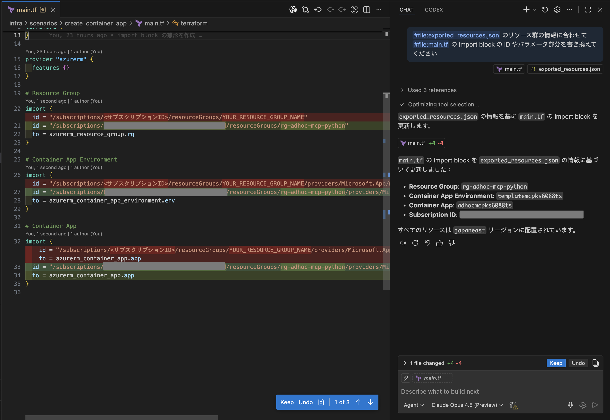
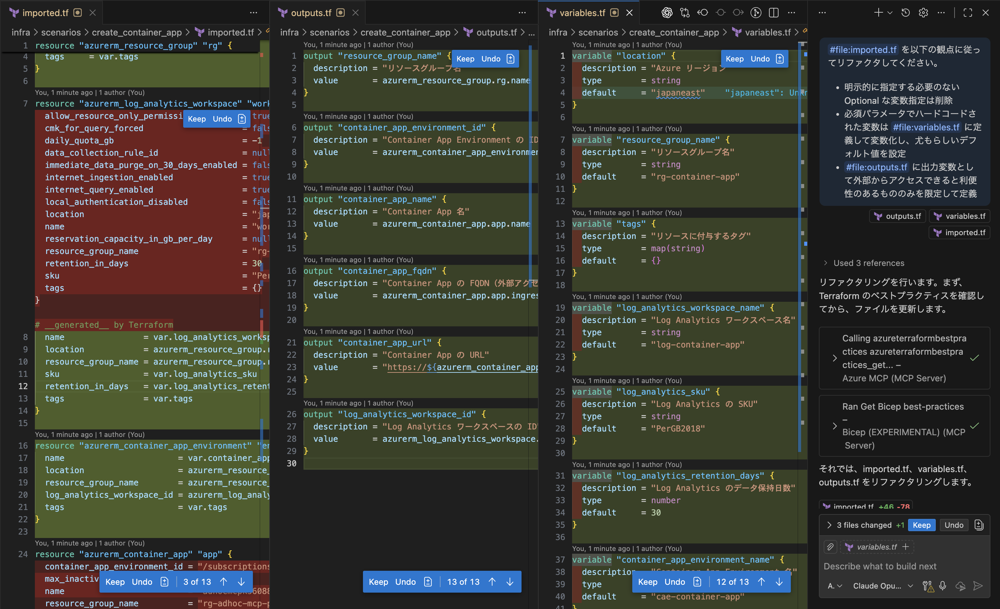
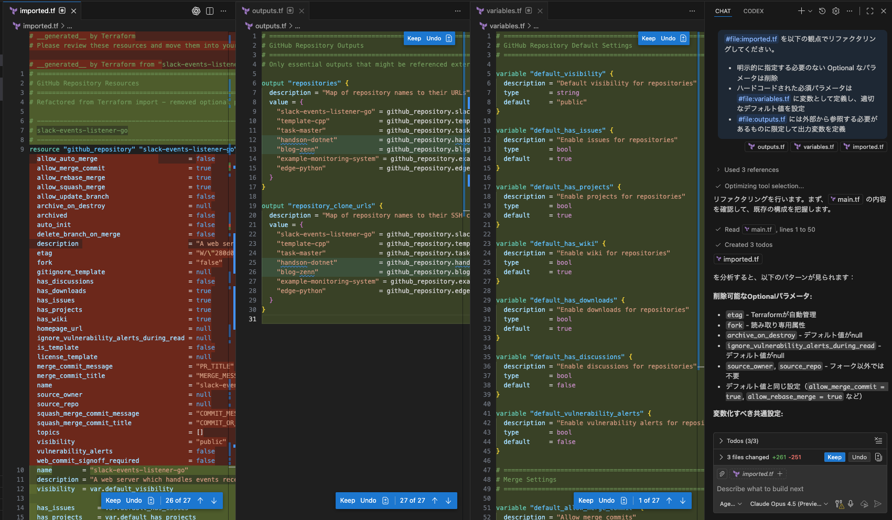

<!-- textlint-disable -->

こちらは [Microsoft Azure Tech Advent Calendar 2025](https://qiita.com/advent-calendar/2025/microsoft-azure-tech) @ 12/11 の記事です。

本記事ではデプロイ済の既存クラウドリソースから Terraform コードを効率的に作成する方法について解説します。
以下のようなシナリオを想定しています。

- クラウドリソースを手動で作成してしまったが、後から Terraform 管理下に置きたい
- 既存リソースを Terraform 管理下に置きたいが、リソース数が多く手動でコード化するのが大変

そこで今回は、これらの課題を生成 AI を組み合わせて解決する方法を紹介します。

<!--truncate-->

---

## TL;DR

- Terraform の [import block](https://developer.hashicorp.com/terraform/language/import) を活用して Azure と GitHub の既存リソースをインポートしてコード化する例を紹介
- CLI ツールでリソース情報をエクスポートし、生成 AI で import block の ID を自動生成
- 自動生成された冗長なコードを生成 AI でリファクタリングし、可読性を向上

---

## Terraform での既存リソースの管理

Terraform の機能を活用して、既存のインフラリソースを管理下に置くことは、多くの組織にとって重要な課題です。
従来、[terraform import コマンド](https://developer.hashicorp.com/terraform/cli/commands/import) を使用して既存リソースを Terraform の状態ファイルに追加する方法が一般的でしたが、この方法にはいくつかの制約があります。
例えば、`terraform import` コマンドはリソースを状態ファイルに追加するだけで、対応する Terraform コードを自動生成しないため、手動でコードを作成する必要があります。

こうした課題に対して、[Terraform v1.5.0](https://github.com/hashicorp/terraform/releases/tag/v1.5.0) で導入された import block が有効です。
import block は、既存のインフラリソースを Terraform 管理下に置くための新しい方法であり、対応する HCL コードを自動生成できます。
import block を使用することで、既存リソースのインポート情報を Terraform コード内に直接記述できるため、コードと状態ファイルの整合性を保ちながら管理を始めることができます。

`import block` の活用手順は [Import resources overview](https://developer.hashicorp.com/terraform/language/import) に一次情報がまとまっています。また、[Terraform v1.5.0 からの新機能：Import Block 機能の紹介と既存ツールとの比較](https://techblog.ap-com.co.jp/entry/2023/06/12/184506) では具体的な例を挙げて import block の使い方が紹介されています。

以下は Azure のリソースグループをインポートする例です。

```hcl title="リソースグループの import block 例"
provider "azurerm" {
    features {}
}

import {
    id = "/subscriptions/YOUR_SUBSCRIPTION_ID/resourceGroups/YOUR_RESOURCE_GROUP_NAME"
    to = azurerm_resource_group.rg
}
```

`import` 部分が import block に該当し、id にはインポートする既存リソースの識別子を指定し、to にはインポート先のリソースタイプと名前を指定します。

次に、以下のコマンドを実行してインポートとコード生成を行います。

```bash title="terraform コマンドの実行"
# Terraform の初期化
terraform init

# 既存リソースのインポートとコード生成
terraform plan -generate-config-out=imported.tf
```

`-generate-config-out` オプションを指定することで、import block で指定した既存リソースに対応する Terraform コードが `imported.tf` ファイルに生成されます。なお、実際のインポート（状態ファイルへの追加）は `terraform apply` を実行した際に行われます。

## 生成 AI を活用して import block のコード化を効率化する

シンプルな例では分かりにくいですが、実際のプロジェクトで大規模に活用しようとすると以下のような課題に直面します。

1. **ID の調査コスト**: リソースごとに import block の `id` を調べてコード化する作業が煩雑
2. **出力コードの可読性**: 自動生成されるコードはすべてのパラメータをハードコードするため、冗長で保守性が低い

以下では、生成 AI を活用してこれらの課題を解決するシナリオを 2 つ紹介します。

1. Azure 上に既にデプロイ済の Azure Container Apps で構築された Web アプリを Terraform 管理下に移行する
1. 既存の GitHub リポジトリ群を Terraform 管理下に移行する

> **補足**: Azure に関しては、[Azure Portal から直接エクスポートする方法](https://learn.microsoft.com/ja-jp/azure/developer/terraform/azure-export-for-terraform/get-started-export-resources-portal?tabs=azure-cli) や、[Azure Export for Terraform](https://learn.microsoft.com/ja-jp/azure/developer/terraform/azure-export-for-terraform/export-terraform-overview) などのプラットフォーム固有のツールが活用できますが、本記事では他のクラウドサービスにも応用できる汎用的なアプローチを紹介します。

### Azure での活用例

Azure ([terraform-provider-azurerm](https://github.com/hashicorp/terraform-provider-azurerm)) での活用例として、ここでは Azure Container Apps で構築された Web アプリをコード化するシナリオを紹介します。
具体的な作業の詳細は [ks6088ts-labs/baseline-environment-on-azure-terraform](https://github.com/ks6088ts-labs/baseline-environment-on-azure-terraform/tree/main/infra/scenarios/create_container_app) で公開しています。

#### 1. import block の ID を生成 AI で自動記述する

`import block` を使用する際、既存リソースの ID を調べてコード化する必要があります。
例えば Azure Container Apps で構築された Web アプリでは、以下のリソースが必要です。

- Resource Group
- Container Apps Environment
- Container App
- Log Analytics Workspace

これらの ID を手動で調べて import block に記述するのは手間がかかります。まず、Azure CLI を使用してリソース情報を取得します。

```bash title="Azure CLI でリソース情報をエクスポート"
RESOURCE_GROUP_NAME="your-resource-group-name"

az resource list \
  --resource-group $RESOURCE_GROUP_NAME \
  --output json > exported_resources.json
```

`exported_resources.json` には、各リソースの `id` フィールドが以下のように含まれており、これが import block に必要な情報です。

```json title="exported_resources.json の抜粋"
[
  {
    "changedTime": "2025-11-30T23:42:36.278188+00:00",
    "createdTime": "2025-11-30T23:32:15.126641+00:00",
    "extendedLocation": null,
    "id": "/subscriptions/$SUBSCRIPTION_ID/resourceGroups/$RESOURCE_GROUP_NAME/providers/Microsoft.OperationalInsights/workspaces/$WORKSPACE_NAME",
    "identity": null,
    "kind": null,
    "location": "japaneast",
    "managedBy": null,
    "name": "$WORKSPACE_NAME",
    "plan": null,
    "properties": null,
    "provisioningState": "Succeeded",
    "resourceGroup": "$RESOURCE_GROUP_NAME",
    "sku": null,
    "tags": null,
    "type": "Microsoft.OperationalInsights/workspaces"
  },
  {
    // 他のリソース情報が続く
  }
]
```

次はこれらの ID を main.tf の import block に記述する必要がありますが、この作業を生成 AI に自動化させます。
GitHub Copilot の Agent mode にこのファイルをコンテキストとして与え、以下のプロンプトを実行します。

```markdown title="import block 自動生成用プロンプト"
#file:exported_resources.json のリソース群の情報に合わせて、
#file:main.tf の import block の ID やパラメータ部分を書き換えてください。
```

これにより、JSON から抽出したリソース ID が main.tf の import block に自動的に反映されます。
比較的小さいスコープに絞った操作であれば、他の生成 AI ツールでも同様の効果が得られることが多いです。
GitHub Copilot での実行結果は以下のようになります。



#### 2. 自動生成コードを生成 AI でリファクタリングする

上記の手順で main.tf を書き換えた後、以下のコマンドでコードを生成します。

```bash title="コード生成"
terraform plan -generate-config-out=imported.tf
```

生成された `imported.tf` には既存リソースに対応する Terraform コードが含まれますが、執筆時点の Terraform / AzureRM Provider では、再利用する観点で以下のような課題があります。

- 多くのパラメータが明示的にハードコードされている
- Provider によっては非推奨（deprecated）なパラメータが含まれることがある
- 可読性が低く、保守が困難な場合がある


Terraform Provider の内部挙動として、Provider が対象とするプラットフォームの REST API から取得したリソース情報を機械的にコードへ変換しているため、すべてのパラメータがハードコードされていると考えられます。
明示的でわかりやすい反面、実際の運用では不要なパラメータが多く含まれていることが一般的です。また、Provider の仕様変更により非推奨となったパラメータが含まれている場合もあります。特に意識しないで済むパラメータはもっともらしいデフォルト値が設定されていることが多いため、コードから削除しても問題ありません。

今度はリファクタのために生成 AI を活用します。`imported.tf` をコンテキストとして与え、以下のプロンプトでリファクタリングを依頼します。

```markdown title="imported.tf のリファクタリング用プロンプトの例"
#file:imported.tf を以下の観点でリファクタリングしてください。

- 明示的に指定する必要のない Optional なパラメータは削除
- ハードコードされた必須パラメータは #file:variables.tf に変数として定義し、適切なデフォルト値を設定
- #file:outputs.tf には外部から参照する必要があるものに限定して出力変数を定義
```

`Claude Opus 4.5` で実行した変更差分は以下のようになります。



補足として、[Terraform MCP Server](https://github.com/hashicorp/terraform-mcp-server) などで LLM の知識を補完することも可能ですが、挙動が安定しない場合があります。最新の Provider 仕様への追従が必要な場合など、本当に必要なケースに限定して活用するのが現時点では現実的かもしれません。

リファクタリングされたコードの動作検証のため、以下のコマンドで検証します。

```bash title="リファクタリング後のコード検証"
# Check whether the configuration is valid
terraform validate

# Show changes required by the current configuration
terraform plan
```

一連の作業で作成したコードは以下の GitHub リポジトリで公開しています。
[ks6088ts-labs/baseline-environment-on-azure-terraform > infra/scenarios/create_container_app](https://github.com/ks6088ts-labs/baseline-environment-on-azure-terraform/tree/main/infra/scenarios/create_container_app)

### GitHub での活用例

次に、Terraform の [GitHub Provider](https://registry.terraform.io/providers/integrations/github/latest/docs) を使用して、既存の GitHub リポジトリを Terraform 管理下に移行するシナリオを紹介します。

#### GitHub 設定のコード化実践例

手順は Azure で実施したときと変わらず、

1. 生成 AI に与えるコンテキスト情報を CLI で収集
1. コンテキスト情報を付加しながら import block を生成 AI で自動記述
1. 状態のインポートとコード生成
1. 生成コードのリファクタリングを生成 AI で実施

という流れになるかと思います。
[個人 GitHub IaC 化 RTA](https://zenn.dev/sqer/articles/906a85fd6a51ee) を参考に、GitHub CLI (`gh`) を使用して自分のアカウントのリポジトリ一覧を取得し、import block の ID 部分を自動生成しました。

```bash title="GitHub リポジトリの import block 自動生成例"
# 作業用ディレクトリを作成
mkdir -p ~/tmp/github-import
cd ~/tmp/github-import

# Import block 用の main.tf を作成
LIMIT=200
repos=$(gh repo list --json name -L $LIMIT --source -q ".[].name")

# main.tf を空にする
echo "" > main.tf

# 各リポジトリ名でループ
# repo 名に . が含まれるとリソース名として不正になるため、_ に置換
for repo in ${(f)repos}; do
  repo_safe=${repo//./_}
  cat <<EOF >> main.tf
import {
  id = "$repo"
  to = github_repository.$repo_safe
}

EOF
done

# コード生成
terraform init
terraform plan -generate-config-out=imported.tf

# 取り込み確認
less imported.tf
```

生成された `imported.tf` は以下のような形になります。

```hcl title="imported.tf の例"
# __generated__ by Terraform
# Please review these resources and move them into your main configuration files.

# __generated__ by Terraform from "slack-events-listener-go"
resource "github_repository" "slack-events-listener-go" {
  allow_auto_merge                        = false
  allow_merge_commit                      = true
  allow_rebase_merge                      = true
  allow_squash_merge                      = true
  allow_update_branch                     = false
  archive_on_destroy                      = null
  archived                                = false
  auto_init                               = false
  delete_branch_on_merge                  = false
  description                             = "A web server which handles events received from Slack Events API written in Go"
  etag                                    = "W/\"280d09908082bd7fed61df89ed1e9dc41caeba6b2d311cd0edfd8582cf4210ce\""
  fork                                    = "false"
  gitignore_template                      = null
  has_discussions                         = false
  has_downloads                           = true
  has_issues                              = true
  has_projects                            = true
  has_wiki                                = true
  homepage_url                            = null
  ignore_vulnerability_alerts_during_read = null
  is_template                             = false
  license_template                        = null
  merge_commit_message                    = "PR_TITLE"
  merge_commit_title                      = "MERGE_MESSAGE"
  name                                    = "slack-events-listener-go"
  source_owner                            = null
  source_repo                             = null
  squash_merge_commit_message             = "COMMIT_MESSAGES"
  squash_merge_commit_title               = "COMMIT_OR_PR_TITLE"
  topics                                  = []
  visibility                              = "public"
  vulnerability_alerts                    = false
  web_commit_signoff_required             = false
  security_and_analysis {
    secret_scanning {
      status = "disabled"
    }
# imported.tf
```

次に、同様に生成 AI を活用してリファクタリングを行います。以下のプロンプトで実行します。

```markdown title="imported.tf のリファクタリング用プロンプトの例"
#file:imported.tf を以下の観点でリファクタリングしてください。

- 明示的に指定する必要のない Optional なパラメータは削除
- ハードコードされた必須パラメータは #file:variables.tf に変数として定義し、適切なデフォルト値を設定
- #file:outputs.tf には外部から参照する必要があるものに限定して出力変数を定義
```

生成されたコードは以下のようになります。



Azure の例と同様に、リファクタリングされたコードの動作検証のため、以下のコマンドで検証します。

```bash title="リファクタリング後のコード検証"
# Check whether the configuration is valid
terraform validate

# Show changes required by the current configuration
terraform plan
```

#### ソニーの全社展開プラクティスに学ぶ

余談ですが、[GitHub Universe 2025 Recap Tokyo](https://github.registration.goldcast.io/events/881d0dd3-da25-4d1b-9a73-7b533dcd9aa4) の発表の中に、[GitHub を組織的に使いこなすために ソニーが実践した全社展開のプラクティス](https://speakerdeck.com/sony/github-wozu-zhi-de-nishi-ikonasutameni-sonigashi-jian-sitaquan-she-zhan-kai-nopurakuteisu) がありました。

[Everything as Code の思想](https://speakerdeck.com/sony/github-wozu-zhi-de-nishi-ikonasutameni-sonigashi-jian-sitaquan-she-zhan-kai-nopurakuteisu?slide=26)で、自社の GitHub 設定を [terraform-provider-github](https://registry.terraform.io/providers/integrations/github/latest/docs) でコード化して管理するという内容でした。GitHub の設定をコード化して管理することは、組織全体での一貫性を保ち、セキュリティとコンプライアンスを強化する上で有効であり、非常に興味深い内容でした。

こうした取り組みを開始するためにも、既存の環境をコード化して管理下におく作業は必要になってくると思います。Terraform import block と生成 AI を組み合わせた今回のアプローチは、こうしたニーズにも応用できると考えています。

## 生成 AI を効果的に活用するためのポイント

### リファクタリングの再現性を高める工夫

CLI を使ってコンテキスト収集したり、import block を使ってコードを生成するところまでは、特に opinionated な部分は少なく、比較的再現性高く実行できると思います。

しかしながら、リファクタリングの部分はどうでしょう。おそらく一意な正解がなくチームやプロジェクトごとに最適解が異なるため、生成 AI の活用方法に工夫が必要だと思います。
例えば変数定義、出力変数の設計、モジュールの切り方などはチームによって方針が異なるため、組織での運用を考えると明示的に規約として定めておくことが望ましいです。

GitHub Copilot の場合、チーム共通のルールなどを [Custom Instructions](https://docs.github.com/ja/copilot/how-tos/configure-custom-instructions/add-repository-instructions) などの機能を活用してコンテキストを与えることで、より一貫性のある成果物を再現性高く得られる可能性があります。コーディング規約を docs ファイルなどにまとめておき、生成 AI に参照させるのも有効です。

### 小さく分割してフィードバックループを回す

生成 AI を活用したリファクタリングは「何が自分の文脈で改善すべきと感じるのか」を明示的に言語化して伝えてフィードバックループを回す作業です。大規模なインフラでは IaC コード側の階層化や、デプロイする環境に応じた分岐なども考慮に入ると思います。こうした複雑な要件を一度に伝えようとすると、生成 AI の出力が不安定になり、期待通りの成果物が得られないことが多いです。Reasoning model の進歩や、[Deep Agents](https://blog.langchain.com/deep-agents/) のようなシステムの進歩にも期待してはいますが、現状複雑なタスクを一度に処理するための生成 AI の制御は個人的にはまだ難しいと感じています。

現状は、人間側がタスクを小さく分割し、段階的に品質の高い成果物を積み上げていく方が、最終的な品質は高くなります。import 直後のコードには多くを求めず、まずは基本的なリファクタリングから始めるといいのではないでしょうか。

## まとめ

本記事では、Terraform import block と生成 AI を組み合わせて、Azure/GitHub 上の既存リソースから効率的に Terraform コードを作成する方法を解説しました。Terraform import block には課題がいくつかあるものの、生成 AI で補完しながら活用することで十分に実用的なソリューションになると感じました。効果的に活用するためのポイントは以下の通りです。

1. **必要なコンテキストを明確化する**

   - 自分が手動で作業する際に参照する情報を洗い出す

2. **決定論的なツールでコンテキストを収集する**

   - 再現性が高くコストも低い決定論的なツールを最大限活用する
   - 例: `az resource list`, `gh repo list` で既存リソース情報をエクスポート

3. **タスクを小さく分割して依頼する**
   - import block の ID 記述とコードのリファクタリングを分けて実行

こうした考え方は Terraform に限らず、既存コードのリファクタリングや移行作業など様々な場面でも適用できると思います。
