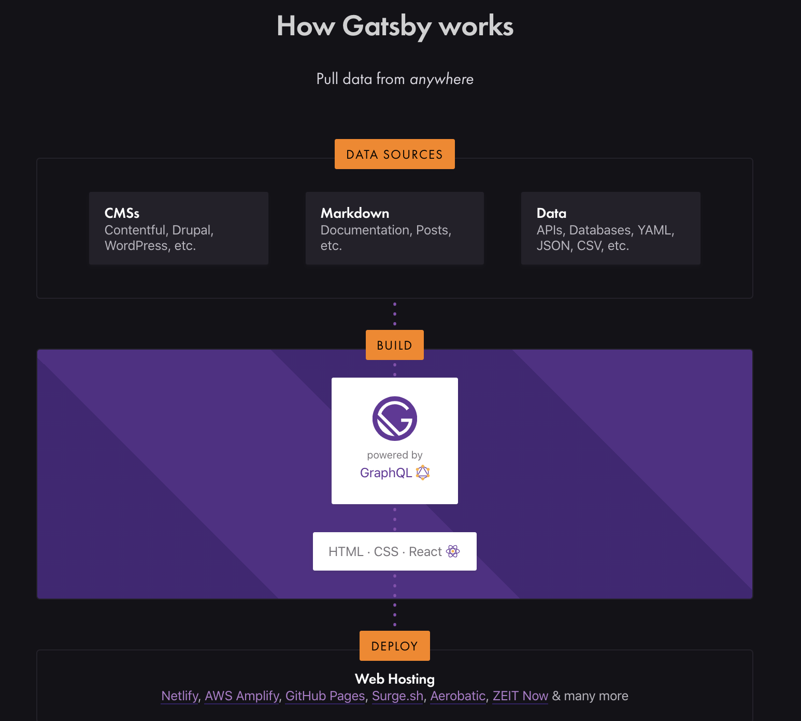

# TL;DR

GatsbyJS でブログシステムを構築して、GitHub Actions で自動デプロイできるようにした話。

## GatsbyJS って何?

WordPress・Contentful 等の各種 CMS、ローカルの Markdown・YAML 等のファイル、API・Database 等をデータソースとして、  
GraphQL を通じて統一的に扱う事ができる静的サイトジェネレータです。  
複数のデータソースを扱えることから、既存のブログシステムから GatsbyJS による静的サイトへの乗り換えも容易です。  



Airbnb や Nike 等、多くの有名企業で採用実績があります。  
また、React ベースで実装されているので、React で UI パーツの追加などがしやすいです。


### Starters と Plugins
GatsbyJSには「Starters」「Plugins」という2つのエコシステムがあります。

**Starters** は簡単にいうとデザインテンプレートにあたります。  
ブログや EC サイトなどさまざまなカテゴリがあり、  
目的にあった Starter を見つけることができれば、スクラッチから書く必要がなく開発の初速が稼げるメリットがあります。

**Plugins** は GatsbyJS で使用できる拡張機能です。  
GoogleAnalytics や PWA対応や多言語対応用のプラグインなど、  
多数のプラグインが充実しており、これらを使えばほぼコーディング不要で機能追加ができてしまいます。  

## Starter を使った GatsbyJS 製サイト構築

まずは Gatsby CLI をインストールします。  
[Using the Gatsby CLI](https://www.gatsbyjs.org/tutorial/part-zero/#using-the-gatsby-cli) にあるように、
```bash
npm install -g gatsby-cli
```
で gatsby コマンドが使えるようになります。  

次は Gatsby CLI で Starter を使ったサイトを生成します。  
Starter は [Gatsby Starters](https://www.gatsbyjs.org/starters/?) にまとまっています。

ここでは例として、[gatsbyjs/gatsby-starter-blog](https://github.com/gatsbyjs/gatsby-starter-blog) を Starter として、下記コマンドで GatsbyJS サイトを作成します。  

```bash
gatsby new site https://github.com/v4iv/gatsby-starter-business
```

API は公式ドキュメント [gatsby-cli/#api-commands](https://www.gatsbyjs.org/docs/gatsby-cli/#api-commands) にまとまっています。  

## GitHub Actions って何?

Travis CI や Circle CI などの CI/CDツールと同様、リポジトリに対するプッシュやプルリクエストといったイベントをトリガーとして、あらかじめ定義しておいた処理を実行する機能です。  
リポジトリ内に設定ファイルを置くだけで、GitHub が提供するサーバー上に用意された仮想マシンで実行できます。  

## GitHub Actions を使って GitHub Pages を更新

まずは GitHub Pages を利用するため、GitHub 上に username.github.io リポジトリを GitHub 上に作成します。  
次に下記の操作を行います。  

```bash
# ↑で生成したディレクトリに移動
cd site

# リモートリポジトリの追加
git remote add origin https://github.com/username/username.github.io.git

# ソースコードを source ブランチで管理するためブランチ名をリネーム
git branch -m master source
```

GitHub Actions の設定ファイルは、```.github/workflows```
以下に置きます。  
ここでは下記の YAML ファイルを追加します。  

```yaml
# .github/workflows/deploy.yml
name: GitHub Pages

on:
  push:
    branches:
      - source
jobs:
  build:
    runs-on: ubuntu-18.04
    steps:
      - uses: actions/checkout@v2

      - name: Setup Node
        uses: actions/setup-node@v1
        with:
          node-version: '10.x'

      - name: Cache dependencies
        uses: actions/cache@v1
        with:
          path: ~/.cache/yarn
          key: ${{ runner.os }}-yarn-${{ hashFiles('**/yarn.lock') }}
          restore-keys: |
            ${{ runner.os }}-yarn-

      - name: Install dependencies
        run: yarn install --frozen-lockfile

      - name: Run build for GitHub Pages
        run: yarn build

      - name: Deploy
        uses: peaceiris/actions-gh-pages@v3
        with:
          github_token: ${{ secrets.GITHUB_TOKEN }}
          publish_dir: ./public
          publish_branch: master
```

これで source ブランチに push したら、public 以下の成果物を master ブランチに push してくれて GitHub Pages が更新されます。  

日々のブログ更新のために必要な作業は、 content/blog/ に記事を push するだけになりました。

## 参考サイト

* GitHub Actions の適用事例として [tokyo-metropolitan-gov/covid19](https://github.com/tokyo-metropolitan-gov/covid19/tree/development/.github/workflows)
* 本家 [Gatsby](https://www.gatsbyjs.org/)
* [GitHub Actions による GitHub Pages への自動デプロイ](https://qiita.com/peaceiris/items/d401f2e5724fdcb0759d)
