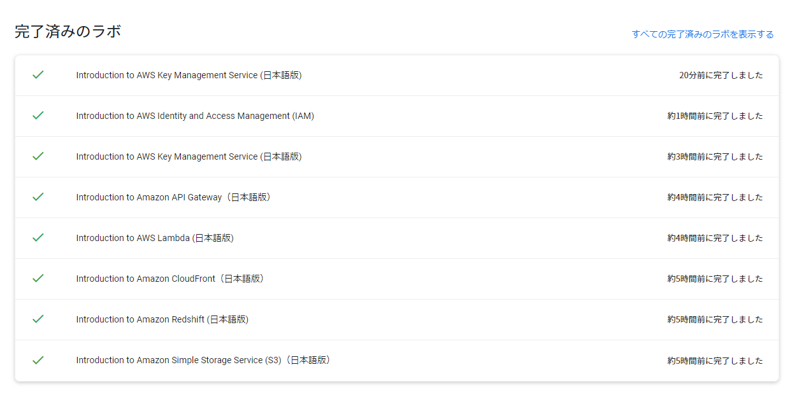

アカウント作成と初期設定をざっくり終えたので、全体を俯瞰するため Amazon で AWS の売れている本を探して乱読してみることにした。  
まず最初の 1 冊目として VPC の設定だとか、EC2, S3 とか基礎的なサービスを理解するために、  
「Amazon Web Services 基礎からのネットワーク＆サーバー構築」を読んだ。  
2021年1月現在、改訂3版も出ていて内容も新しい。  

<iframe style="width:120px;height:240px;" marginwidth="0" marginheight="0" scrolling="no" frameborder="0" src="//rcm-fe.amazon-adsystem.com/e/cm?lt1=_blank&bc1=000000&IS2=1&bg1=FFFFFF&fc1=000000&lc1=0000FF&t=ks6088ts-22&language=ja_JP&o=9&p=8&l=as4&m=amazon&f=ifr&ref=as_ss_li_til&asins=B084QQ7TCF&linkId=6c66687e3bf98ebdf7ccb767a29d6d18"></iframe>

読み終わった段階で、今流行りのサーバレスアーキテクチャとか、その他サービスの使い方も知りたくなってきたので、  
「AWS 入門認定資格試験テキスト AWS認定ソリューションアーキテクト - アソシエイト 改訂第2版 (日本語) 」を読み始めた。  
別に資格を取りたいわけではないのだが、全体のサービスを俯瞰して知っている状態は、  
今後技術的になにか解決したい課題があったときにネタ帳として役立つはず。  
この本も最近改訂第2版がでて内容は新しい。さらに初版の評判も良さそうなので早速買って読むことにした。  

<iframe style="width:120px;height:240px;" marginwidth="0" marginheight="0" scrolling="no" frameborder="0" src="//rcm-fe.amazon-adsystem.com/e/cm?lt1=_blank&bc1=000000&IS2=1&bg1=FFFFFF&fc1=000000&lc1=0000FF&t=ks6088ts-22&language=ja_JP&o=9&p=8&l=as4&m=amazon&f=ifr&ref=as_ss_li_til&asins=4815607389&linkId=b826505f6b66b399ddab30b92443a474"></iframe>

ざっくりパラパラ読んで演習問題解いた段階で、やっぱ座学だと頭に入らないなぁと思い、  
学習法の項でおすすめされていた Qwiklabs のハンズオンをやってみることにした。  
やったコンテンツと感想を以下に垂れ流す。

---

**[Introduction to Amazon DynamoDB（日本語版）](https://www.qwiklabs.com/focuses/14815?catalog_rank=%7B%22rank%22%3A1%2C%22num_filters%22%3A0%2C%22has_search%22%3Atrue%7D&parent=catalog&search_id=8684240)**  
DynamoDB を GUI 操作でテーブル作成、データ作成、クエリ実行する無料ハンズオン。  
あくまでクライアント側の操作の紹介だけであって、深い突っ込んだところを触るわけではない。  
読んで実行するだけなら体感 10 分もかからない。  

**[Introduction to Amazon Simple Storage Service (S3)（日本語版）](https://www.qwiklabs.com/focuses/15683?catalog_rank=%7B%22rank%22%3A2%2C%22num_filters%22%3A2%2C%22has_search%22%3Afalse%7D&parent=catalog)**  
バケット作成、オブジェクトアップロード、パブリック化、バケットポリシーの適用、バージョニングあたりが学べる。  
個人的には 2 点学びがあった。  
1. オブジェクトのパブリック化  
公開設定にする手順をあえて多段階にしたり、  
念押しチェックボックスを設けるなどの GUI 上のアラート。  
昔はこういったUIがなかったが、うっかりミスを起こしてきた人たちのフィードバックを受けて取り入れたのだろう。
オブジェクトのパブリック化周りの作業順序に齟齬があり少し手順書が古いようだったが、  
行間を読んで一通り確認できた。  

2. バージョニング  
バージョニング対象のオブジェクトを削除した場合は「削除マーカー」が付く。  
復元したい場合は、バージョンのリスト表示を有効にして削除マーカーを削除することで削除前のバージョンに復元される、とか。  
ポリシージェネレータの設定は GUI から json 生成してコピペする操作フローになっていたけど、  
せっかく GUI なんだから(json コピペすら隠蔽して) ポチポチで済ませたら UX 良いのではないの？と思ったり。(多分他に術があるのだろう)

**[Introduction to Amazon EC2 (日本語版)](https://www.qwiklabs.com/focuses/14761?catalog_rank=%7B%22rank%22%3A3%2C%22num_filters%22%3A2%2C%22has_search%22%3Afalse%7D&parent=catalog)**  
VPS のリッチ版という印象な EC2。少し触ってたことあるしクレジット 1 消費するので斜め読みするだけ。  

**[Introduction to Amazon Redshift (日本語版)](https://www.qwiklabs.com/focuses/14177?catalog_rank=%7B%22rank%22%3A4%2C%22num_filters%22%3A2%2C%22has_search%22%3Afalse%7D&parent=catalog)**  
なんかクラスタの起動に失敗したのでスキップ。

**[Introduction to Amazon CloudFront（日本語版）](https://www.qwiklabs.com/focuses/15612?catalog_rank=%7B%22rank%22%3A7%2C%22num_filters%22%3A2%2C%22has_search%22%3Afalse%7D&parent=catalog)**  
S3 でパブリックにアクセスできるバケットを作成しておくと、  
CloudFront からドメイン選択する際にサジェストされるの良い UX で感心した。  
(知らずに S3 の URL 確認しに行ってた)  
配信設定の 1 単位を CloudFront Distribution と呼ぶようだ。  
グローバルなコンテンツ配信ネットワークであるため、リージョン選択はない。(Web Console は英語表示しかない?)  
CloudFront の Distribution 削除は、->Disabled->Delete と手順を踏む必要があるけど、Disabled になるまで結構時間がかかる。

**[Introduction to AWS Lambda (日本語版)](https://www.qwiklabs.com/focuses/15682?catalog_rank=%7B%22rank%22%3A8%2C%22num_filters%22%3A2%2C%22has_search%22%3Afalse%7D&parent=catalog)**  
S3 のオブジェクト作成イベントをトリガーとして Lambda 関数を呼び、オブジェクトを加工したものを別バケットに追加するサンプル。  
当たり前ではあるが、入出力のバケットが同一である場合は再帰呼び出しになり費用増大、なんてリスクがあるので、Web 上の UI で注意喚起があった。

> 関数が S3 バケットにオブジェクトを書き込む場合は、入出力に異なる S3 バケットを使用してください。同じバケットに書き込むと、再帰呼び出しを生み出すリスクが高くなり、その結果、Lambda の使用量が増加してコストが増大する可能性があります。

というか、そもそもそういったユースケースは実行できないようにプラットフォーム側でポリシー制御すると親切なのではないだろうか。  
実行できないと都合の悪いケースってあるのかなぁもやもや...?

Lambda 関数は Web console 上のエディタで編集する他、S3 にアップロードした zip ファイルを実行する方法もある。(ハンズオンでは後者)  
AWS の他のサービスとの連携などで `boto3` だったりサードパーティ製ライブラリを利用するのがほとんどのケースだと思うので zip 参照がメインのユースケースなのかなと。

**[Introduction to Amazon API Gateway（日本語版）](https://www.qwiklabs.com/focuses/10383?catalog_rank=%7B%22rank%22%3A6%2C%22num_filters%22%3A2%2C%22has_search%22%3Afalse%7D&parent=catalog)**  
テクニカルコンセプトの項はスッキリまとまっていて「マイクロサービスとは何か」をざっくり把握するのに良い。  
ある程度大規模なソフトウェア開発を経験していればあるあるな話ではあるけれど。  
Lambda 関数は単に配列で確保した FAQ の配列をランダムに選択して json で返すシンプルなもの。  
まぁあくまで API Gateway の Introduction なので、トリガーとして API Gateway を設定するところが肝なのだから Lambda 側の説明によるノイズが少なくていいサンプルだと思った。  
「API 呼び出せました」で終わるのではなく、モニタリングタブから CloudWatch のログ表示するまでをハンズオンで記載してくれているのは、「お家に帰るまでが遠足ですよ」みたいなノリを感じて好感が持てた。

**[Introduction to AWS Identity and Access Management (IAM)](https://www.qwiklabs.com/focuses/15717?catalog_rank=%7B%22rank%22%3A28%2C%22num_filters%22%3A1%2C%22has_search%22%3Afalse%7D&parent=catalog)**

予めセキュリティポリシーがアタッチされたグループがあり、ユーザをそれぞれ指定されたグループに追加する。  
各ユーザが適切に権限設定されていることを各ユーザとしてマネジメントコンソールにログインして確認。  
地味だけど大事な操作。  
ブラウザ操作するときログインセッションを削除するのが面倒なので Chrome のシークレットモードが役立った。  

**[Introduction to AWS Key Management Service (日本語版)](https://www.qwiklabs.com/focuses/15699?catalog_rank=%7B%22rank%22%3A9%2C%22num_filters%22%3A2%2C%22has_search%22%3Afalse%7D&parent=catalog)**  
KMS でのマスターキー生成とデータの暗号化、CloudTrail を利用したキーアクセスのモニタリング。

---

以上、軽く流した感じではあるけれど大体 5 時間でざっくり入門はできた様子。  

GCP, Azure 等の他社のクラウドサービスを使い倒したわけではないのだが、  
AWS 触ってていいなと入門しながら思ったところを言語化すると、

- いい感じのデフォルトで埋めてくれる
- API Gateway + Lambda みたいなあるあるなサービス間の連携を簡単にできる GUI
- やばい設定はアラートしてくれる

あたりにある。
他社サービスでも同様のことはできるが、ユーザのフィードバックを受けて改善するサイクルを鬼のように回しまくった老舗ならではの部分がAWS のサービスとしての競争力にあるのかなぁ。  

座学よりはハンズオンのほうが身になる事がわかったので、  
次もいい感じのハンズオン教材に気合い入れて取り組む予定。  
[自宅で学ぼう！AWS 初学者向けの勉強方法 6ステップ！](https://aws.amazon.com/jp/blogs/news/aws-beginner-home-learning/) によると、  
ハンズオンおすすめ教材として QWIKLABS の他に、

- [AWS 初心者向けハンズオン](https://aws.amazon.com/jp/aws-jp-introduction/aws-jp-webinar-hands-on/)
- [10分間チュートリアル](https://aws.amazon.com/jp/getting-started/hands-on/)

もあるようなのでチェックしてみます。
